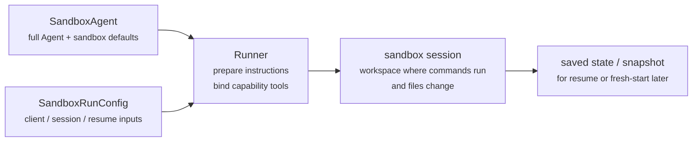
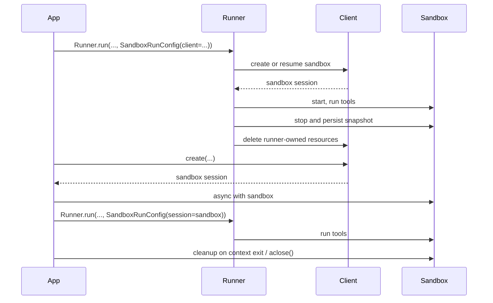

---
search:
  exclude: true
---
# 概念

!!! warning "ベータ機能"

    Sandbox エージェントは ベータ版 です。一般提供前に API の詳細、デフォルト値、サポート対象機能は変更される可能性があり、時間の経過とともにより高度な機能が追加されます。

モダンなエージェントは、ファイルシステム上の実ファイルを扱えると最も効果的に動作します。 **Sandbox Agents** は、特殊なツールやシェルコマンドを使って、大規模なドキュメント集合の検索と操作、ファイル編集、成果物生成、コマンド実行を行えます。sandbox は、モデルに対して永続的なワークスペースを提供し、エージェントがユーザーの代わりに作業できるようにします。Agents SDK の Sandbox エージェントは、sandbox 環境と組み合わせたエージェント実行を簡単にし、ファイルシステムへの適切なファイル配置や、タスクの開始・停止・再開を大規模に容易にする sandbox のエージェントオーケストレーションを支援します。

ワークスペースは、エージェントに必要なデータを中心に定義します。GitHub リポジトリ、ローカルファイルとディレクトリ、合成タスクファイル、S3 や Azure Blob Storage などのリモートファイルシステム、その他ユーザーが提供する sandbox 入力を起点にできます。

<div class="sandbox-harness-image" markdown="1">


</div>

`SandboxAgent` は依然として `Agent` です。`instructions`、`prompt`、`tools`、`handoffs`、`mcp_servers`、`model_settings`、`output_type`、ガードレール、hooks など通常のエージェント表面を維持し、通常の `Runner` API を通して実行されます。変わるのは実行境界です。

- `SandboxAgent` はエージェント自体を定義します。通常のエージェント設定に加えて、`default_manifest`、`base_instructions`、`run_as` などの sandbox 固有デフォルトや、ファイルシステムツール、シェルアクセス、skills、memory、compaction などの機能を含みます。
- `Manifest` は、新しい sandbox ワークスペースの希望する初期内容とレイアウトを宣言します。ファイル、リポジトリ、マウント、環境を含みます。
- sandbox session は、コマンド実行とファイル変更が行われるライブな分離環境です。
- [`SandboxRunConfig`][agents.run_config.SandboxRunConfig] は、その実行がどのように sandbox session を取得するかを決定します。たとえば、直接注入、直列化済み sandbox session state からの再接続、sandbox client を介した新規作成などです。
- 保存済み sandbox state と snapshot により、後続実行で過去作業へ再接続したり、保存内容から新しい sandbox session をシードしたりできます。

`Manifest` は新規セッション用ワークスペース契約であり、すべてのライブ sandbox の完全な唯一情報源ではありません。実行時の実効ワークスペースは、再利用された sandbox session、直列化済み sandbox session state、または実行時に選択された snapshot から構成される場合があります。

このページ全体で「sandbox session」は sandbox client が管理するライブ実行環境を意味します。これは [Sessions](../sessions/index.md) で説明される SDK の会話用 [`Session`][agents.memory.session.Session] インターフェースとは異なります。

外側のランタイムは、承認、トレーシング、ハンドオフ、再開管理を引き続き担当します。sandbox session はコマンド、ファイル変更、環境分離を担当します。この分割がモデルの中核です。

### 要素の適合

sandbox 実行は、エージェント定義と実行ごとの sandbox 設定を組み合わせます。runner はエージェントを準備し、ライブ sandbox session に紐づけ、後続実行用に state を保存できます。



sandbox 固有のデフォルトは `SandboxAgent` に置きます。実行ごとの sandbox session 選択は `SandboxRunConfig` に置きます。

ライフサイクルは 3 段階で考えます。

1. `SandboxAgent`、`Manifest`、機能でエージェントと新規ワークスペース契約を定義します。
2. `Runner` に sandbox session の注入・再開・作成を指定する `SandboxRunConfig` を渡して実行します。
3. 後で、runner 管理の `RunState`、明示的な sandbox `session_state`、または保存済みワークスペース snapshot から継続します。

シェルアクセスが単発的な補助ツールに過ぎない場合は、[tools guide](../tools.md) の hosted shell から始めてください。ワークスペース分離、sandbox client 選択、sandbox session 再開挙動が設計要件なら sandbox エージェントを使ってください。

## 利用場面

sandbox エージェントは、ワークスペース中心のワークフローに適しています。例:

- コーディングとデバッグ（例: GitHub リポジトリの issue レポート修正を自動化でエージェントオーケストレーションし、対象テストを実行）
- 文書処理と編集（例: ユーザーの財務文書から情報抽出し、税務フォームの下書きを作成）
- ファイル根拠のレビューや分析（例: 回答前に onboarding パケット、生成レポート、成果物バンドルを確認）
- 分離されたマルチエージェントパターン（例: 各レビュアーやコーディング子エージェントに専用ワークスペースを付与）
- 複数段階ワークスペースタスク（例: ある実行でバグ修正し、後で回帰テスト追加、または snapshot / sandbox session state から再開）

ファイルや生きたファイルシステムへのアクセスが不要なら、`Agent` を使い続けてください。シェルアクセスが時々必要なだけなら hosted shell を追加し、ワークスペース境界自体が機能要件なら sandbox エージェントを使います。

## sandbox client の選択

ローカル開発は `UnixLocalSandboxClient` から始めます。コンテナ分離やイメージ同一性が必要なら `DockerSandboxClient` に移行します。プロバイダー管理実行が必要なら hosted provider に移行します。

多くの場合、`SandboxAgent` 定義はそのままで、[`SandboxRunConfig`][agents.run_config.SandboxRunConfig] 内の sandbox client とオプションのみ変更します。ローカル、Docker、hosted、リモートマウントの選択肢は [Sandbox clients](clients.md) を参照してください。

## 中核要素

<div class="sandbox-nowrap-first-column-table" markdown="1">

| Layer | Main SDK pieces | What it answers |
| --- | --- | --- |
| エージェント定義 | `SandboxAgent`, `Manifest`, capabilities | どのエージェントを実行し、どの新規セッションワークスペース契約から開始すべきですか？ |
| sandbox 実行 | `SandboxRunConfig`、sandbox client、ライブ sandbox session | この実行はどうやってライブ sandbox session を取得し、どこで作業が実行されますか？ |
| 保存済み sandbox state | `RunState` sandbox payload、`session_state`、snapshots | このワークフローは、過去の sandbox 作業へどう再接続し、保存内容から新しい sandbox session をどうシードしますか？ |

</div>

主要 SDK 要素は次のように対応します。

<div class="sandbox-nowrap-first-column-table" markdown="1">

| Piece | What it owns | Ask this question |
| --- | --- | --- |
| [`SandboxAgent`][agents.sandbox.sandbox_agent.SandboxAgent] | エージェント定義 | このエージェントは何をすべきで、どのデフォルトを持ち運ぶべきですか？ |
| [`Manifest`][agents.sandbox.manifest.Manifest] | 新規セッションのワークスペースファイルとフォルダー | 実行開始時、ファイルシステム上にどのファイルとフォルダーが存在すべきですか？ |
| [`Capability`][agents.sandbox.capabilities.capability.Capability] | sandbox ネイティブ挙動 | どのツール、instruction 断片、ランタイム挙動をこのエージェントに付与すべきですか？ |
| [`SandboxRunConfig`][agents.run_config.SandboxRunConfig] | 実行ごとの sandbox client と sandbox session ソース | この実行は sandbox session を注入・再開・作成すべきですか？ |
| [`RunState`][agents.run_state.RunState] | runner 管理の保存済み sandbox state | 過去の runner 管理ワークフローを再開し、sandbox state を自動で引き継いでいますか？ |
| [`SandboxRunConfig.session_state`][agents.run_config.SandboxRunConfig.session_state] | 明示的な直列化済み sandbox session state | `RunState` 外で既に直列化した sandbox state から再開したいですか？ |
| [`SandboxRunConfig.snapshot`][agents.run_config.SandboxRunConfig.snapshot] | 新規 sandbox session 用の保存済みワークスペース内容 | 新しい sandbox session を保存済みファイルと成果物から開始すべきですか？ |

</div>

実践的な設計順序:

1. `Manifest` で新規セッションワークスペース契約を定義
2. `SandboxAgent` でエージェントを定義
3. 組み込みまたはカスタム capability を追加
4. `RunConfig(sandbox=SandboxRunConfig(...))` で実行ごとの sandbox session 取得方法を決定

## sandbox 実行の準備

実行時、runner はこの定義を具体的な sandbox 実行へ変換します。

1. `SandboxRunConfig` から sandbox session を解決します。  
   `session=...` を渡すと、そのライブ sandbox session を再利用します。  
   それ以外は `client=...` で作成または再開します。
2. 実行の実効ワークスペース入力を決定します。  
   実行が sandbox session を注入または再開する場合、既存 sandbox state が優先されます。  
   それ以外は、1 回限りの manifest override か `agent.default_manifest` から開始します。  
   このため、`Manifest` 単体ではすべての実行の最終ライブワークスペースを定義しません。
3. capability によって生成された manifest を処理させます。  
   これにより、最終エージェント準備前に capability がファイル、マウント、その他ワークスペース範囲の挙動を追加できます。
4. 固定順で最終 instructions を構築します。  
   SDK 既定の sandbox prompt（明示 override 時は `base_instructions`）、次に `instructions`、次に capability instruction 断片、次にリモートマウントポリシーテキスト、最後にレンダリング済みファイルシステムツリー。
5. capability tools をライブ sandbox session にバインドし、通常の `Runner` API で準備済みエージェントを実行します。

sandbox 化してもターンの意味は変わりません。ターンは依然としてモデルステップであり、単一シェルコマンドや sandbox 操作ではありません。sandbox 側操作とターンの 1:1 対応は固定ではありません。sandbox 実行レイヤー内で完結する作業もあれば、ツール結果・承認・その他 state 返却で次のモデルステップが必要になる場合もあります。実務上は、sandbox 作業後にエージェントランタイムが次のモデル応答を必要とした時だけ追加ターンが消費されます。

この準備手順により、`default_manifest`、`instructions`、`base_instructions`、`capabilities`、`run_as` が `SandboxAgent` 設計時の主要な sandbox 固有オプションになります。

## `SandboxAgent` オプション

通常の `Agent` フィールドに加えた sandbox 固有オプションです。

<div class="sandbox-nowrap-first-column-table" markdown="1">

| Option | Best use |
| --- | --- |
| `default_manifest` | runner が作成する新規 sandbox session の既定ワークスペース。 |
| `instructions` | SDK sandbox prompt の後に追加される役割・ワークフロー・成功条件。 |
| `base_instructions` | SDK sandbox prompt を置き換える高度なエスケープハッチ。 |
| `capabilities` | このエージェントと共に持ち運ぶ sandbox ネイティブツールと挙動。 |
| `run_as` | シェルコマンド、ファイル読み取り、パッチなどモデル向け sandbox ツールのユーザー ID。 |

</div>

sandbox client 選択、sandbox session 再利用、manifest override、snapshot 選択は、エージェントではなく [`SandboxRunConfig`][agents.run_config.SandboxRunConfig] に属します。

### `default_manifest`

`default_manifest` は、このエージェント向けに runner が新規 sandbox session を作成する時に使う既定の [`Manifest`][agents.sandbox.manifest.Manifest] です。通常開始時に必要なファイル、リポジトリ、補助資料、出力ディレクトリ、マウントに使います。

これはあくまで既定値です。実行時に `SandboxRunConfig(manifest=...)` で上書きでき、再利用・再開された sandbox session は既存ワークスペース state を保持します。

### `instructions` と `base_instructions`

`instructions` は、異なる prompt をまたいで維持したい短いルールに使います。`SandboxAgent` では、これら instructions は SDK の sandbox 基本 prompt の後に追加されるため、組み込みの sandbox ガイダンスを保持しつつ、独自の役割・ワークフロー・成功条件を追加できます。

`base_instructions` は SDK sandbox 基本 prompt を置き換えたい時だけ使います。ほとんどのエージェントでは不要です。

<div class="sandbox-nowrap-first-column-table" markdown="1">

| Put it in... | Use it for | Examples |
| --- | --- | --- |
| `instructions` | エージェントの安定した役割、ワークフロールール、成功条件。 | "onboarding 文書を確認してから handoff する。", "最終ファイルは `output/` に書き込む。" |
| `base_instructions` | SDK sandbox 基本 prompt の完全置換。 | カスタム低レベル sandbox wrapper prompts。 |
| user prompt | この実行限定のリクエスト。 | "このワークスペースを要約してください。" |
| manifest のワークスペースファイル | 長めのタスク仕様、repo ローカル instructions、制約付き参照資料。 | `repo/task.md`, 文書バンドル, sample packets。 |

</div>

`instructions` の良い使い方:

- [examples/sandbox/unix_local_pty.py](https://github.com/openai/openai-agents-python/blob/main/examples/sandbox/unix_local_pty.py) は、PTY state が重要な場合に 1 つの対話プロセス内でエージェントを維持します。
- [examples/sandbox/handoffs.py](https://github.com/openai/openai-agents-python/blob/main/examples/sandbox/handoffs.py) は、確認後に sandbox reviewer がユーザーへ直接回答することを禁止します。
- [examples/sandbox/tax_prep.py](https://github.com/openai/openai-agents-python/blob/main/examples/sandbox/tax_prep.py) は、最終入力済みファイルが実際に `output/` に出力されることを要求します。
- [examples/sandbox/docs/coding_task.py](https://github.com/openai/openai-agents-python/blob/main/examples/sandbox/docs/coding_task.py) は、検証コマンドを固定し、workspace root 相対の patch path を明確化します。

避けるべきこと: ユーザーの単発タスクを `instructions` にコピーすること、manifest に置くべき長い参照資料の埋め込み、組み込み capability が既に注入するツールドキュメントの繰り返し、実行時にモデル不要なローカルインストール注意点の混在。

`instructions` を省略しても、SDK は既定の sandbox prompt を含めます。低レベル wrapper には十分ですが、多くのユーザー向けエージェントでは明示的 `instructions` を提供すべきです。

### `capabilities`

capability は `SandboxAgent` に sandbox ネイティブ挙動を付与します。実行開始前にワークスペースを整形し、sandbox 固有 instructions を追加し、ライブ sandbox session にバインドされるツールを公開し、そのエージェント向けにモデル挙動や入力処理を調整できます。

組み込み capability には次が含まれます。

<div class="sandbox-nowrap-first-column-table" markdown="1">

| Capability | Add it when | Notes |
| --- | --- | --- |
| `Shell` | エージェントにシェルアクセスが必要。 | `exec_command` を追加。sandbox client が PTY 対話対応なら `write_stdin` も追加。 |
| `Filesystem` | エージェントがファイル編集やローカル画像確認を行う。 | `apply_patch` と `view_image` を追加。patch path は workspace root 相対。 |
| `Skills` | sandbox で skill の発見と materialization を行いたい。 | sandbox ローカル `SKILL.md` skills では `.agents` / `.agents/skills` の手動マウントより推奨。 |
| `Memory` | 後続実行で memory 成果物を読んだり生成したい。 | `Shell` 必須。ライブ更新には `Filesystem` も必要。 |
| `Compaction` | 長時間フローで compaction items 後の文脈トリミングが必要。 | モデルサンプリングと入力処理を調整。 |

</div>

既定で `SandboxAgent.capabilities` は `Capabilities.default()` を使い、`Filesystem()`、`Shell()`、`Compaction()` を含みます。`capabilities=[...]` を渡すと既定を置換するため、必要な既定 capability は明示的に含めてください。

skills は materialization 方針に応じて source を選びます。

- `Skills(lazy_from=LocalDirLazySkillSource(...))` は、大きなローカル skill ディレクトリの既定として有効です。モデルはまず index を発見し、必要分だけ読み込めます。
- `Skills(from_=LocalDir(src=...))` は、小規模ローカル bundle を先に配置したい場合に適します。
- `Skills(from_=GitRepo(repo=..., ref=...))` は、skills 自体をリポジトリ由来にしたい場合に適します。

skills が既に `.agents/skills/<name>/SKILL.md` のようにディスク上にある場合、`LocalDir(...)` をその source root に向け、公開は `Skills(...)` を使ってください。既存ワークスペース契約で別レイアウト依存がない限り、既定 `skills_path=".agents"` を維持してください。

適合するなら組み込み capability を優先してください。組み込みで不足する sandbox 固有ツールや instruction 面が必要な場合のみカスタム capability を作成します。

## 概念

### Manifest

[`Manifest`][agents.sandbox.manifest.Manifest] は新規 sandbox session のワークスペースを記述します。workspace `root` 設定、ファイル・ディレクトリ宣言、ローカルファイル取り込み、Git リポジトリ clone、リモートストレージマウント接続、環境変数設定、ユーザー/グループ定義が可能です。

Manifest エントリの path は workspace 相対です。絶対 path や `..` による workspace 脱出はできず、これによりローカル、Docker、hosted client 間でワークスペース契約の可搬性が保たれます。

manifest エントリは、作業開始前に必要な素材に使います。

<div class="sandbox-nowrap-first-column-table" markdown="1">

| Manifest entry | Use it for |
| --- | --- |
| `File`, `Dir` | 小さな合成入力、補助ファイル、出力ディレクトリ。 |
| `LocalFile`, `LocalDir` | sandbox に materialize すべきホストファイル/ディレクトリ。 |
| `GitRepo` | workspace に取得すべきリポジトリ。 |
| `S3Mount`, `GCSMount`, `R2Mount`, `AzureBlobMount`, `S3FilesMount` など mounts | sandbox 内に表示すべき外部ストレージ。 |

</div>

mount エントリは公開するストレージを記述し、mount strategy は sandbox backend がそのストレージを接続する方法を記述します。mount オプションと provider サポートは [Sandbox clients](clients.md#mounts-and-remote-storage) を参照してください。

良い manifest 設計は通常、ワークスペース契約を絞り込み、長いタスク手順は `repo/task.md` のようなワークスペースファイルに置き、instructions では `repo/task.md` や `output/report.md` のような相対 workspace path を使うことです。`Filesystem` capability の `apply_patch` ツールでファイル編集する場合、patch path はシェル `workdir` ではなく sandbox workspace root 相対である点に注意してください。

### Permissions

`Permissions` は manifest エントリのファイルシステム権限を制御します。対象は sandbox が materialize するファイルであり、モデル権限、承認ポリシー、API 認証情報ではありません。

既定では、manifest エントリは owner に読み取り/書き込み/実行、group と others に読み取り/実行が許可されます。配置ファイルを非公開・読み取り専用・実行可能にしたい場合は上書きします。

```python
from agents.sandbox import FileMode, Permissions
from agents.sandbox.entries import File

private_notes = File(
    text="internal notes",
    permissions=Permissions(
        owner=FileMode.READ | FileMode.WRITE,
        group=FileMode.NONE,
        other=FileMode.NONE,
    ),
)
```

`Permissions` は owner/group/other の各ビットと、エントリがディレクトリかどうかを保持します。直接構築、`Permissions.from_str(...)` で mode 文字列から解析、または `Permissions.from_mode(...)` で OS mode から導出できます。

ユーザーは作業実行可能な sandbox ID です。その ID を sandbox に存在させたい場合は manifest に `User` を追加し、シェルコマンド、ファイル読み取り、patch などモデル向け sandbox ツールをそのユーザーで実行したい場合は `SandboxAgent.run_as` を設定します。`run_as` が manifest にないユーザーを指す場合、runner が実効 manifest に追加します。

```python
from agents import Runner
from agents.run import RunConfig
from agents.sandbox import FileMode, Manifest, Permissions, SandboxAgent, SandboxRunConfig, User
from agents.sandbox.entries import Dir, LocalDir
from agents.sandbox.sandboxes.unix_local import UnixLocalSandboxClient

analyst = User(name="analyst")

agent = SandboxAgent(
    name="Dataroom analyst",
    instructions="Review the files in `dataroom/` and write findings to `output/`.",
    default_manifest=Manifest(
        # Declare the sandbox user so manifest entries can grant access to it.
        users=[analyst],
        entries={
            "dataroom": LocalDir(
                src="./dataroom",
                # Let the analyst traverse and read the mounted dataroom, but not edit it.
                group=analyst,
                permissions=Permissions(
                    owner=FileMode.READ | FileMode.EXEC,
                    group=FileMode.READ | FileMode.EXEC,
                    other=FileMode.NONE,
                ),
            ),
            "output": Dir(
                # Give the analyst a writable scratch/output directory for artifacts.
                group=analyst,
                permissions=Permissions(
                    owner=FileMode.ALL,
                    group=FileMode.ALL,
                    other=FileMode.NONE,
                ),
            ),
        },
    ),
    # Run model-facing sandbox actions as this user, so those permissions apply.
    run_as=analyst,
)

result = await Runner.run(
    agent,
    "Summarize the contracts and call out renewal dates.",
    run_config=RunConfig(
        sandbox=SandboxRunConfig(client=UnixLocalSandboxClient()),
    ),
)
```

ファイルレベル共有ルールも必要なら、users と manifest groups とエントリ `group` metadata を組み合わせます。`run_as` ユーザーは sandbox ネイティブ操作の実行主体を制御し、`Permissions` は workspace materialize 後にそのユーザーがどのファイルを読み取り・書き込み・実行できるかを制御します。

### SnapshotSpec

`SnapshotSpec` は、新規 sandbox session が保存済みワークスペース内容をどこから復元し、どこへ永続化するかを指定します。これは sandbox ワークスペースの snapshot policy であり、`session_state` は特定 sandbox backend 再開用の直列化接続 state です。

ローカル永続 snapshot には `LocalSnapshotSpec`、アプリがリモート snapshot client を提供する場合は `RemoteSnapshotSpec` を使います。ローカル snapshot 設定が利用不可の場合は no-op snapshot がフォールバックされ、ワークスペース snapshot 永続化が不要な高度利用者は明示的に no-op を選べます。

```python
from pathlib import Path

from agents.run import RunConfig
from agents.sandbox import LocalSnapshotSpec, SandboxRunConfig
from agents.sandbox.sandboxes.unix_local import UnixLocalSandboxClient

run_config = RunConfig(
    sandbox=SandboxRunConfig(
        client=UnixLocalSandboxClient(),
        snapshot=LocalSnapshotSpec(base_path=Path("/tmp/my-sandbox-snapshots")),
    )
)
```

runner が新規 sandbox session を作成すると、sandbox client はそのセッション用 snapshot instance を構築します。開始時、snapshot が復元可能なら保存済みワークスペース内容を復元してから実行を継続します。クリーンアップ時、runner 所有 sandbox session はワークスペースをアーカイブし、snapshot 経由で永続化します。

`snapshot` を省略すると、ランタイムは可能な場合に既定ローカル snapshot 位置を使おうとします。設定できない場合は no-op snapshot にフォールバックします。マウント済み path と一時 path は耐久ワークスペース内容として snapshot にコピーされません。

### sandbox ライフサイクル

ライフサイクルモードは 2 つあります: **SDK 所有** と **開発者所有**。

<div class="sandbox-lifecycle-diagram" markdown="1">



</div>

sandbox を 1 回の実行だけ生かせばよい場合は SDK 所有を使います。`client`、任意 `manifest`、任意 `snapshot`、client `options` を渡すと、runner が sandbox を作成/再開、開始、エージェント実行、snapshot 対応ワークスペース state 永続化、sandbox 停止、runner 所有リソースの client cleanup まで行います。

```python
result = await Runner.run(
    agent,
    "Inspect the workspace and summarize what changed.",
    run_config=RunConfig(
        sandbox=SandboxRunConfig(client=UnixLocalSandboxClient()),
    ),
)
```

事前作成したい、1 つのライブ sandbox を複数実行で再利用したい、実行後にファイル確認したい、自分で作成した sandbox 上でストリーミングしたい、cleanup タイミングを厳密制御したい場合は開発者所有を使います。`session=...` を渡すと、runner はそのライブ sandbox を使いますが、クローズはしません。

```python
sandbox = await client.create(manifest=agent.default_manifest)

async with sandbox:
    run_config = RunConfig(sandbox=SandboxRunConfig(session=sandbox))
    await Runner.run(agent, "Analyze the files.", run_config=run_config)
    await Runner.run(agent, "Write the final report.", run_config=run_config)
```

通常はコンテキストマネージャー形です。入場時に sandbox を開始し、終了時に session cleanup ライフサイクルを実行します。コンテキストマネージャーを使えない場合はライフサイクルメソッドを直接呼びます。

```python
sandbox = await client.create(
    manifest=agent.default_manifest,
    snapshot=LocalSnapshotSpec(base_path=Path("/tmp/my-sandbox-snapshots")),
)
try:
    await sandbox.start()
    await Runner.run(
        agent,
        "Analyze the files.",
        run_config=RunConfig(sandbox=SandboxRunConfig(session=sandbox)),
    )
    # Persist a checkpoint of the live workspace before doing more work.
    # `aclose()` also calls `stop()`, so this is only needed for an explicit mid-lifecycle save.
    await sandbox.stop()
finally:
    await sandbox.aclose()
```

`stop()` は snapshot 対応ワークスペース内容を永続化するだけで、sandbox を破棄しません。`aclose()` は完全な session cleanup 経路で、pre-stop hooks 実行、`stop()` 呼び出し、sandbox リソース停止、session スコープ依存のクローズを行います。

## `SandboxRunConfig` オプション

[`SandboxRunConfig`][agents.run_config.SandboxRunConfig] は、sandbox session の取得元と新規セッション初期化方法を決める実行ごとのオプションを保持します。

### sandbox ソース

これらのオプションで、runner が sandbox session を再利用・再開・作成するかを決定します。

<div class="sandbox-nowrap-first-column-table" markdown="1">

| Option | Use it when | Notes |
| --- | --- | --- |
| `client` | runner に sandbox session の作成・再開・cleanup を任せたい。 | ライブ sandbox `session` を渡さない限り必須。 |
| `session` | 既に自分でライブ sandbox session を作成済み。 | ライフサイクルは呼び出し側所有。runner はそのライブ sandbox session を再利用。 |
| `session_state` | sandbox session state は直列化済みだがライブ session object はない。 | `client` 必須。runner はその明示 state から所有セッションとして再開。 |

</div>

実際には、runner は次の順序で sandbox session を解決します。

1. `run_config.sandbox.session` を注入した場合、そのライブ sandbox session を直接再利用。
2. それ以外で実行が `RunState` から再開される場合、保存済み sandbox session state を再開。
3. それ以外で `run_config.sandbox.session_state` を渡した場合、その明示直列化 sandbox session state から再開。
4. それ以外は新規 sandbox session を作成。新規セッションでは、`run_config.sandbox.manifest` があればそれを使い、なければ `agent.default_manifest` を使います。

### 新規セッション入力

これらのオプションは、runner が新規 sandbox session を作成する時のみ有効です。

<div class="sandbox-nowrap-first-column-table" markdown="1">

| Option | Use it when | Notes |
| --- | --- | --- |
| `manifest` | 1 回限りの新規セッションワークスペース上書きをしたい。 | 省略時は `agent.default_manifest` にフォールバック。 |
| `snapshot` | 新規 sandbox session を snapshot からシードしたい。 | 再開風フローやリモート snapshot client に有用。 |
| `options` | sandbox client に作成時オプションが必要。 | Docker イメージ、Modal app 名、E2B templates、timeout など client 固有設定で一般的。 |

</div>

### materialization 制御

`concurrency_limits` は sandbox materialization 作業の並列度を制御します。大きな manifest やローカルディレクトリコピーでリソース制御を厳密化したい場合は `SandboxConcurrencyLimits(manifest_entries=..., local_dir_files=...)` を使います。特定制限を無効化するにはその値を `None` にします。

留意点:

- 新規セッション: `manifest=` と `snapshot=` は runner が新規 sandbox session を作成する場合のみ適用。
- 再開と snapshot: `session_state=` は直列化済み sandbox state へ再接続し、`snapshot=` は保存済みワークスペース内容から新しい sandbox session をシード。
- client 固有オプション: `options=` は sandbox client 依存。Docker と多くの hosted client では必須。
- 注入ライブセッション: 実行中 sandbox `session` を渡した場合、capability 駆動 manifest 更新で互換の非マウントエントリ追加は可能。`manifest.root`、`manifest.environment`、`manifest.users`、`manifest.groups` の変更、既存エントリ削除、エントリ型置換、マウントエントリ追加/変更は不可。
- runner API: `SandboxAgent` 実行は通常の `Runner.run()`、`Runner.run_sync()`、`Runner.run_streamed()` を使います。

## 完全例: コーディングタスク

このコーディングスタイル例は良い既定の出発点です。

```python
import asyncio
from pathlib import Path

from agents import ModelSettings, Runner
from agents.run import RunConfig
from agents.sandbox import Manifest, SandboxAgent, SandboxRunConfig
from agents.sandbox.capabilities import (
    Capabilities,
    LocalDirLazySkillSource,
    Skills,
)
from agents.sandbox.entries import LocalDir
from agents.sandbox.sandboxes.unix_local import UnixLocalSandboxClient

EXAMPLE_DIR = Path(__file__).resolve().parent
HOST_REPO_DIR = EXAMPLE_DIR / "repo"
HOST_SKILLS_DIR = EXAMPLE_DIR / "skills"
TARGET_TEST_CMD = "sh tests/test_credit_note.sh"


def build_agent(model: str) -> SandboxAgent[None]:
    return SandboxAgent(
        name="Sandbox engineer",
        model=model,
        instructions=(
            "Inspect the repo, make the smallest correct change, run the most relevant checks, "
            "and summarize the file changes and risks. "
            "Read `repo/task.md` before editing files. Stay grounded in the repository, preserve "
            "existing behavior, and mention the exact verification command you ran. "
            "Use the `$credit-note-fixer` skill before editing files. If the repo lives under "
            "`repo/`, remember that `apply_patch` paths stay relative to the sandbox workspace "
            "root, so edits still target `repo/...`."
        ),
        # Put repos and task files in the manifest.
        default_manifest=Manifest(
            entries={
                "repo": LocalDir(src=HOST_REPO_DIR),
            }
        ),
        capabilities=Capabilities.default() + [
            # Let Skills(...) stage and index sandbox-local skills for you.
            Skills(
                lazy_from=LocalDirLazySkillSource(
                    source=LocalDir(src=HOST_SKILLS_DIR),
                )
            ),
        ],
        model_settings=ModelSettings(tool_choice="required"),
    )


async def main(model: str, prompt: str) -> None:
    result = await Runner.run(
        build_agent(model),
        prompt,
        run_config=RunConfig(
            sandbox=SandboxRunConfig(client=UnixLocalSandboxClient()),
            workflow_name="Sandbox coding example",
        ),
    )
    print(result.final_output)


if __name__ == "__main__":
    asyncio.run(
        main(
            model="gpt-5.4",
            prompt=(
                "Open `repo/task.md`, use the `$credit-note-fixer` skill, fix the bug, "
                f"run `{TARGET_TEST_CMD}`, and summarize the change."
            ),
        )
    )
```

[examples/sandbox/docs/coding_task.py](https://github.com/openai/openai-agents-python/blob/main/examples/sandbox/docs/coding_task.py) を参照してください。例を Unix ローカル実行間で決定的に検証できるよう、小さな shell ベース repo を使っています。実際のタスクリポジトリはもちろん Python、JavaScript、その他何でも構いません。

## 共通パターン

まず上記完全例を基準にしてください。多くの場合、同じ `SandboxAgent` を維持しつつ、sandbox client、sandbox session ソース、またはワークスペースソースだけを変更できます。

### sandbox client の切り替え

エージェント定義は維持し、実行設定だけ変更します。コンテナ分離やイメージ同一性が必要なら Docker、プロバイダー管理実行が必要なら hosted provider を使います。例と provider オプションは [Sandbox clients](clients.md) を参照してください。

### ワークスペース上書き

エージェント定義は維持し、新規セッション manifest だけ差し替えます。

```python
from agents.run import RunConfig
from agents.sandbox import Manifest, SandboxRunConfig
from agents.sandbox.entries import GitRepo
from agents.sandbox.sandboxes.unix_local import UnixLocalSandboxClient

run_config = RunConfig(
    sandbox=SandboxRunConfig(
        client=UnixLocalSandboxClient(),
        manifest=Manifest(
            entries={
                "repo": GitRepo(repo="openai/openai-agents-python", ref="main"),
            }
        ),
    ),
)
```

同じエージェント役割を、エージェント再構築なしで異なる repo、packets、task bundles に適用したい時に使います。上の検証済みコーディング例は、1 回限り override の代わりに `default_manifest` で同じパターンを示しています。

### sandbox session 注入

明示ライフサイクル制御、実行後確認、出力コピーが必要な場合はライブ sandbox session を注入します。

```python
from agents import Runner
from agents.run import RunConfig
from agents.sandbox import SandboxRunConfig
from agents.sandbox.sandboxes.unix_local import UnixLocalSandboxClient

client = UnixLocalSandboxClient()
sandbox = await client.create(manifest=agent.default_manifest)

async with sandbox:
    result = await Runner.run(
        agent,
        prompt,
        run_config=RunConfig(
            sandbox=SandboxRunConfig(session=sandbox),
        ),
    )
```

実行後にワークスペースを確認したい、または既に開始済み sandbox session 上でストリーミングしたい場合に使います。[examples/sandbox/docs/coding_task.py](https://github.com/openai/openai-agents-python/blob/main/examples/sandbox/docs/coding_task.py) と [examples/sandbox/docker/docker_runner.py](https://github.com/openai/openai-agents-python/blob/main/examples/sandbox/docker/docker_runner.py) を参照してください。

### session state から再開

`RunState` 外で既に sandbox state を直列化している場合、その state から runner に再接続させます。

```python
from agents.run import RunConfig
from agents.sandbox import SandboxRunConfig

serialized = load_saved_payload()
restored_state = client.deserialize_session_state(serialized)

run_config = RunConfig(
    sandbox=SandboxRunConfig(
        client=client,
        session_state=restored_state,
    ),
)
```

sandbox state が自前ストレージやジョブシステムにあり、`Runner` にそこから直接再開させたい場合に使います。serialize / deserialize フローは [examples/sandbox/extensions/blaxel_runner.py](https://github.com/openai/openai-agents-python/blob/main/examples/sandbox/extensions/blaxel_runner.py) を参照してください。

### snapshot から開始

保存済みファイルと成果物から新しい sandbox をシードします。

```python
from pathlib import Path

from agents.run import RunConfig
from agents.sandbox import LocalSnapshotSpec, SandboxRunConfig
from agents.sandbox.sandboxes.unix_local import UnixLocalSandboxClient

run_config = RunConfig(
    sandbox=SandboxRunConfig(
        client=UnixLocalSandboxClient(),
        snapshot=LocalSnapshotSpec(base_path=Path("/tmp/my-sandbox-snapshot")),
    ),
)
```

新規実行を `agent.default_manifest` だけでなく保存済みワークスペース内容から開始したい場合に使います。ローカル snapshot フローは [examples/sandbox/memory.py](https://github.com/openai/openai-agents-python/blob/main/examples/sandbox/memory.py)、リモート snapshot client は [examples/sandbox/sandbox_agent_with_remote_snapshot.py](https://github.com/openai/openai-agents-python/blob/main/examples/sandbox/sandbox_agent_with_remote_snapshot.py) を参照してください。

### Git から skills 読み込み

ローカル skill source をリポジトリ由来のものへ切り替えます。

```python
from agents.sandbox.capabilities import Capabilities, Skills
from agents.sandbox.entries import GitRepo

capabilities = Capabilities.default() + [
    Skills(from_=GitRepo(repo="sdcoffey/tax-prep-skills", ref="main")),
]
```

skills bundle に独自リリースサイクルがある場合や sandbox 間で共有したい場合に使います。[examples/sandbox/tax_prep.py](https://github.com/openai/openai-agents-python/blob/main/examples/sandbox/tax_prep.py) を参照してください。

### ツールとして公開

ツールエージェントは、独自 sandbox 境界を持つか、親実行のライブ sandbox を再利用できます。再利用は高速な読み取り専用 explorer エージェントに有効です。別 sandbox の作成・hydration・snapshot コストなしで、親が使う正確なワークスペースを確認できます。

```python
from agents import Runner
from agents.run import RunConfig
from agents.sandbox import FileMode, Manifest, Permissions, SandboxAgent, SandboxRunConfig, User
from agents.sandbox.entries import Dir, File
from agents.sandbox.sandboxes.unix_local import UnixLocalSandboxClient

coordinator = User(name="coordinator")
explorer = User(name="explorer")

manifest = Manifest(
    users=[coordinator, explorer],
    entries={
        "pricing_packet": Dir(
            group=coordinator,
            permissions=Permissions(
                owner=FileMode.ALL,
                group=FileMode.ALL,
                other=FileMode.READ | FileMode.EXEC,
                directory=True,
            ),
            children={
                "pricing.md": File(
                    content=b"Pricing packet contents...",
                    group=coordinator,
                    permissions=Permissions(
                        owner=FileMode.ALL,
                        group=FileMode.ALL,
                        other=FileMode.READ,
                    ),
                ),
            },
        ),
        "work": Dir(
            group=coordinator,
            permissions=Permissions(
                owner=FileMode.ALL,
                group=FileMode.ALL,
                other=FileMode.NONE,
                directory=True,
            ),
        ),
    },
)

pricing_explorer = SandboxAgent(
    name="Pricing Explorer",
    instructions="Read `pricing_packet/` and summarize commercial risk. Do not edit files.",
    run_as=explorer,
)

client = UnixLocalSandboxClient()
sandbox = await client.create(manifest=manifest)

async with sandbox:
    shared_run_config = RunConfig(
        sandbox=SandboxRunConfig(session=sandbox),
    )

    orchestrator = SandboxAgent(
        name="Revenue Operations Coordinator",
        instructions="Coordinate the review and write final notes to `work/`.",
        run_as=coordinator,
        tools=[
            pricing_explorer.as_tool(
                tool_name="review_pricing_packet",
                tool_description="Inspect the pricing packet and summarize commercial risk.",
                run_config=shared_run_config,
                max_turns=2,
            ),
        ],
    )

    result = await Runner.run(
        orchestrator,
        "Review the pricing packet, then write final notes to `work/summary.md`.",
        run_config=shared_run_config,
    )
```

ここでは親エージェントは `coordinator` として動作し、explorer ツールエージェントは同じライブ sandbox session 内で `explorer` として動作します。`pricing_packet/` エントリは `other` ユーザーに読み取り可能なので explorer は素早く確認できますが、書き込みビットはありません。`work/` ディレクトリは coordinator の user/group のみ利用可能なので、親は最終成果物を書き込める一方、explorer は読み取り専用を維持します。

代わりにツールエージェントに実際の分離が必要なら、専用 sandbox `RunConfig` を与えます。

```python
from docker import from_env as docker_from_env

from agents.run import RunConfig
from agents.sandbox import SandboxRunConfig
from agents.sandbox.sandboxes.docker import DockerSandboxClient, DockerSandboxClientOptions

rollout_agent.as_tool(
    tool_name="review_rollout_risk",
    tool_description="Inspect the rollout packet and summarize implementation risk.",
    run_config=RunConfig(
        sandbox=SandboxRunConfig(
            client=DockerSandboxClient(docker_from_env()),
            options=DockerSandboxClientOptions(image="python:3.14-slim"),
        ),
    ),
)
```

ツールエージェントに自由な変更、非信頼コマンド実行、または別 backend/image 使用をさせたい場合は別 sandbox を使います。[examples/sandbox/sandbox_agents_as_tools.py](https://github.com/openai/openai-agents-python/blob/main/examples/sandbox/sandbox_agents_as_tools.py) を参照してください。

### ローカルツールと MCP との併用

sandbox ワークスペースを維持しつつ、同一エージェントで通常ツールも使います。

```python
from agents.sandbox import SandboxAgent
from agents.sandbox.capabilities import Shell

agent = SandboxAgent(
    name="Workspace reviewer",
    instructions="Inspect the workspace and call host tools when needed.",
    tools=[get_discount_approval_path],
    mcp_servers=[server],
    capabilities=[Shell()],
)
```

ワークスペース確認がエージェント業務の一部に過ぎない場合に使います。[examples/sandbox/sandbox_agent_with_tools.py](https://github.com/openai/openai-agents-python/blob/main/examples/sandbox/sandbox_agent_with_tools.py) を参照してください。

## Memory

将来の sandbox エージェント実行が過去実行から学習すべき場合は `Memory` capability を使います。Memory は SDK の会話 `Session` memory と別です。学習内容を sandbox ワークスペース内ファイルへ蒸留し、後続実行がそれらファイルを読めます。

設定、読み取り/生成挙動、複数ターン会話、レイアウト分離は [Agent memory](memory.md) を参照してください。

## 構成パターン

単一エージェントパターンが明確になったら、次の設計課題は大きなシステム内でどこに sandbox 境界を置くかです。

sandbox エージェントは SDK の他要素とも合成できます。

- [Handoffs](../handoffs.md): 非 sandbox intake エージェントから、文書中心作業を sandbox reviewer に handoff。
- [Agents as tools](../tools.md#agents-as-tools): 複数 sandbox エージェントをツールとして公開。通常は各 `Agent.as_tool(...)` 呼び出しに `run_config=RunConfig(sandbox=SandboxRunConfig(...))` を渡し、各ツールに独立 sandbox 境界を与えます。
- [MCP](../mcp.md) と通常の関数ツール: sandbox capability は `mcp_servers` や通常 Python ツールと共存可能です。
- [Running agents](../running_agents.md): sandbox 実行も通常 `Runner` API を使います。

特によくある 2 パターン:

- ワークフローのうちワークスペース分離が必要な部分だけ、非 sandbox エージェントから sandbox エージェントへ handoff
- オーケストレーターが複数 sandbox エージェントをツール公開し、通常は各 `Agent.as_tool(...)` 呼び出しごとに別 sandbox `RunConfig` を設定して各ツールに独立ワークスペースを与える

### ターンと sandbox 実行

handoff と agent-as-tool 呼び出しは分けて考えると分かりやすくなります。

handoff では、依然としてトップレベル実行 1 つとトップレベルターンループ 1 つです。アクティブエージェントは変わりますが、実行は入れ子になりません。非 sandbox intake エージェントが sandbox reviewer へ handoff すると、同じ実行内の次モデル呼び出しは sandbox エージェント向けに準備され、その sandbox エージェントが次ターンを担当します。つまり handoff は同じ実行の次ターン所有エージェントを変更します。[examples/sandbox/handoffs.py](https://github.com/openai/openai-agents-python/blob/main/examples/sandbox/handoffs.py) を参照してください。

`Agent.as_tool(...)` では関係が異なります。外側オーケストレーターは 1 つの外側ターンでツール呼び出しを決定し、そのツール呼び出しが sandbox エージェントの入れ子実行を開始します。入れ子実行は独自ターンループ、`max_turns`、承認、通常は独自 sandbox `RunConfig` を持ちます。入れ子ターン 1 回で終わる場合もあれば複数かかる場合もあります。外側オーケストレーター視点では、これら作業は依然として 1 回のツール呼び出しの背後にあるため、入れ子ターンは外側実行のターンカウンターを増やしません。[examples/sandbox/sandbox_agents_as_tools.py](https://github.com/openai/openai-agents-python/blob/main/examples/sandbox/sandbox_agents_as_tools.py) を参照してください。

承認挙動も同じ分割に従います。

- handoff では、sandbox エージェントがその実行のアクティブエージェントになるため、承認は同じトップレベル実行上に留まる
- `Agent.as_tool(...)` では、sandbox ツールエージェント内で発生した承認も外側実行に現れるが、保存された入れ子実行 state 由来であり、外側実行再開時に入れ子 sandbox 実行も再開される

## 参考資料

- [Quickstart](quickstart.md): 1 つの sandbox エージェントを動かす。
- [Sandbox clients](clients.md): ローカル、Docker、hosted、マウントの選択肢。
- [Agent memory](memory.md): 過去 sandbox 実行の学習内容を保存・再利用。
- [examples/sandbox/](https://github.com/openai/openai-agents-python/tree/main/examples/sandbox): 実行可能なローカル、コーディング、memory、handoff、エージェント合成パターン。