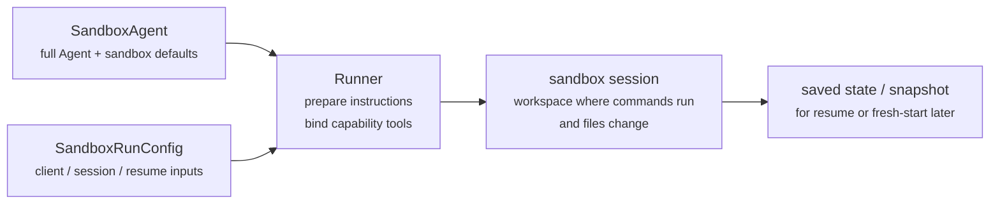
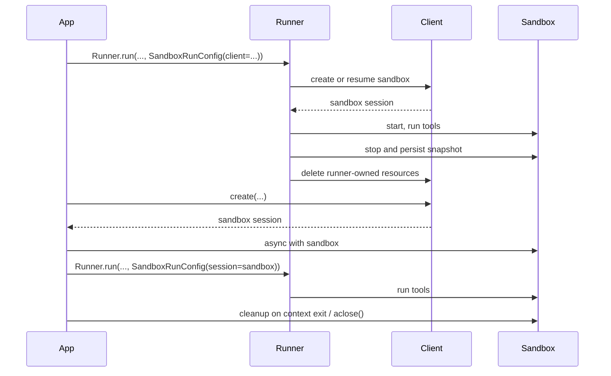

---
search:
  exclude: true
---
# 概念

!!! warning "ベータ機能"

    Sandbox Agents はベータ版です。一般提供までに API の詳細、デフォルト値、サポートされる機能は変更される可能性があり、また今後より高度な機能が追加されていく予定です。

現代のエージェントは、ファイルシステム上の実際のファイルを操作できるときに最も効果を発揮します。**Sandbox Agents** は、専用ツールやシェルコマンドを利用して、大規模なドキュメント集合の検索や操作、ファイル編集、成果物の生成、コマンド実行を行えます。サンドボックスは、モデルに永続的なワークスペースを提供し、エージェントがユーザーに代わって作業できるようにします。Agents SDK の Sandbox Agents は、サンドボックス環境と組み合わせたエージェントを簡単に実行できるようにし、ファイルシステム上に適切なファイルを配置しやすくするとともに、サンドボックスの開始、停止、再開を大規模に容易にするためのエージェントオーケストレーションを支援します。

ワークスペースは、エージェントが必要とするデータを中心に定義します。GitHub リポジトリ、ローカルのファイルやディレクトリ、合成タスクファイル、S3 や Azure Blob Storage などのリモートファイルシステム、およびユーザーが提供するその他のサンドボックス入力から開始できます。

<div class="sandbox-harness-image" markdown="1">


</div>

`SandboxAgent` は引き続き `Agent` です。`instructions`、`prompt`、`tools`、`handoffs`、`mcp_servers`、`model_settings`、`output_type`、ガードレール、フックなど、通常のエージェントの表面はそのまま維持され、通常の `Runner` API を通じて実行されます。変わるのは実行境界です。

- `SandboxAgent` はエージェント自体を定義します。通常のエージェント設定に加えて、`default_manifest`、`base_instructions`、`run_as` のようなサンドボックス固有のデフォルトや、ファイルシステムツール、シェルアクセス、スキル、メモリ、コンパクションといった機能を含みます。
- `Manifest` は、新しいサンドボックスワークスペースの望ましい初期内容とレイアウトを宣言します。これには、ファイル、リポジトリ、マウント、環境が含まれます。
- サンドボックスセッションは、コマンドが実行され、ファイルが変更される、隔離されたライブ環境です。
- [`SandboxRunConfig`][agents.run_config.SandboxRunConfig] は、その実行がどのようにサンドボックスセッションを取得するかを決定します。たとえば、直接注入する、シリアライズ済みのサンドボックスセッション状態から再接続する、またはサンドボックスクライアント経由で新しいサンドボックスセッションを作成する、といった方法です。
- 保存済みサンドボックス状態とスナップショットにより、後続の実行で以前の作業に再接続したり、保存済み内容から新しいサンドボックスセッションを初期化したりできます。

`Manifest` は新規セッション用ワークスペースの契約であり、すべてのライブサンドボックスに対する完全な真実の情報源ではありません。実行時の実効ワークスペースは、再利用されたサンドボックスセッション、シリアライズ済みサンドボックスセッション状態、または実行時に選択されたスナップショットから供給される場合があります。

このページ全体で、「サンドボックスセッション」はサンドボックスクライアントによって管理されるライブ実行環境を意味します。これは、[Sessions](../sessions/index.md) で説明されている SDK の会話用 [`Session`][agents.memory.session.Session] インターフェースとは異なります。

外側のランタイムは、引き続き承認、トレーシング、ハンドオフ、再開の記録管理を担います。サンドボックスセッションは、コマンド、ファイル変更、環境分離を担います。この分離はモデルの中核的な部分です。

### 構成要素の関係

サンドボックス実行では、エージェント定義と実行ごとのサンドボックス設定が組み合わされます。ランナーはエージェントを準備し、それをライブサンドボックスセッションに結び付け、後続の実行のために状態を保存できます。



サンドボックス固有のデフォルトは `SandboxAgent` に保持されます。実行ごとのサンドボックスセッション選択は `SandboxRunConfig` に保持されます。

ライフサイクルは 3 つの段階で考えるとよいでしょう。

1. `SandboxAgent`、`Manifest`、および各種機能によって、エージェントと新規ワークスペース契約を定義します。
2. サンドボックスセッションを注入、再開、または作成する `SandboxRunConfig` を `Runner` に渡して実行します。
3. ランナーが管理する `RunState`、明示的なサンドボックス `session_state`、または保存済みワークスペーススナップショットから後で継続します。

シェルアクセスが単なる補助的なツールの 1 つにすぎないなら、まずは [tools guide](../tools.md) の hosted shell を使ってください。ワークスペース分離、サンドボックスクライアントの選択、またはサンドボックスセッションの再開挙動が設計の一部である場合に、sandbox agents を使います。

## 利用場面

sandbox agents は、ワークスペース中心のワークフローに適しています。たとえば次のようなものです。

- コーディングとデバッグ。たとえば GitHub リポジトリ内の issue レポートに対する自動修正をエージェントオーケストレーションし、対象を絞ったテストを実行する
- ドキュメント処理と編集。たとえばユーザーの財務書類から情報を抽出し、記入済みの納税フォーム草案を作成する
- ファイルに基づくレビューや分析。たとえば回答前に onboarding packet、生成されたレポート、または成果物バンドルを確認する
- 分離されたマルチエージェントパターン。たとえば各レビュアーやコーディング用サブエージェントに専用ワークスペースを与える
- 複数段階のワークスペースタスク。たとえばある実行でバグを修正し、後で回帰テストを追加する、あるいはスナップショットやサンドボックスセッション状態から再開する

ファイルや生きたファイルシステムへのアクセスが不要であれば、引き続き `Agent` を使用してください。シェルアクセスが単に時々必要な機能であれば hosted shell を追加し、ワークスペース境界そのものが機能の一部であれば sandbox agents を使用します。

## サンドボックスクライアントの選択

ローカル開発では `UnixLocalSandboxClient` から始めてください。コンテナ分離やイメージの同一性が必要になったら `DockerSandboxClient` に移行します。プロバイダー管理の実行が必要なら hosted provider に移行してください。

多くの場合、`SandboxAgent` の定義はそのままで、サンドボックスクライアントとそのオプションだけが [`SandboxRunConfig`][agents.run_config.SandboxRunConfig] で変わります。ローカル、 Docker 、 hosted 、リモートマウントのオプションについては [Sandbox clients](clients.md) を参照してください。

## コア要素

<div class="sandbox-nowrap-first-column-table" markdown="1">

| レイヤー | 主な SDK 要素 | 何に答えるか |
| --- | --- | --- |
| エージェント定義 | `SandboxAgent`、`Manifest`、各種機能 | どのエージェントが動作し、どのような新規セッションワークスペース契約から開始すべきですか。 |
| サンドボックス実行 | `SandboxRunConfig`、サンドボックスクライアント、ライブサンドボックスセッション | この実行はどのようにライブサンドボックスセッションを取得し、作業はどこで実行されますか。 |
| 保存済みサンドボックス状態 | `RunState` のサンドボックスペイロード、`session_state`、スナップショット | このワークフローは以前のサンドボックス作業にどう再接続するか、または保存済み内容から新しいサンドボックスセッションをどう初期化するか。 |

</div>

主な SDK 要素は、これらのレイヤーに次のように対応します。

<div class="sandbox-nowrap-first-column-table" markdown="1">

| 要素 | 管理対象 | この質問をする |
| --- | --- | --- |
| [`SandboxAgent`][agents.sandbox.sandbox_agent.SandboxAgent] | エージェント定義 | このエージェントは何を行い、どのデフォルトを一緒に持ち運ぶべきですか。 |
| [`Manifest`][agents.sandbox.manifest.Manifest] | 新規セッションワークスペースのファイルとフォルダー | 実行開始時に、ファイルシステム上にどのファイルとフォルダーが存在すべきですか。 |
| [`Capability`][agents.sandbox.capabilities.capability.Capability] | サンドボックスネイティブな挙動 | どのツール、命令断片、またはランタイム挙動をこのエージェントに付与すべきですか。 |
| [`SandboxRunConfig`][agents.run_config.SandboxRunConfig] | 実行ごとのサンドボックスクライアントとサンドボックスセッション取得元 | この実行はサンドボックスセッションを注入、再開、または作成すべきですか。 |
| [`RunState`][agents.run_state.RunState] | ランナー管理の保存済みサンドボックス状態 | 以前のランナー管理ワークフローを再開し、そのサンドボックス状態を自動的に引き継いでいますか。 |
| [`SandboxRunConfig.session_state`][agents.run_config.SandboxRunConfig.session_state] | 明示的にシリアライズされたサンドボックスセッション状態 | すでに `RunState` の外でシリアライズしたサンドボックス状態から再開したいですか。 |
| [`SandboxRunConfig.snapshot`][agents.run_config.SandboxRunConfig.snapshot] | 新しいサンドボックスセッション用の保存済みワークスペース内容 | 新しいサンドボックスセッションを保存済みファイルや成果物から開始すべきですか。 |

</div>

実践的な設計順序は次のとおりです。

1. `Manifest` で新規セッションワークスペース契約を定義します。
2. `SandboxAgent` でエージェントを定義します。
3. 組み込みまたはカスタムの機能を追加します。
4. 各実行がどのように `RunConfig(sandbox=SandboxRunConfig(...))` でサンドボックスセッションを取得するかを決めます。

## サンドボックス実行の準備方法

実行時に、ランナーはその定義を具体的なサンドボックス対応実行へ変換します。

1. `SandboxRunConfig` からサンドボックスセッションを解決します。
   `session=...` を渡した場合、そのライブサンドボックスセッションを再利用します。
   そうでない場合は `client=...` を使用して作成または再開します。
2. 実行の実効ワークスペース入力を決定します。
   実行がサンドボックスセッションを注入または再開する場合、その既存のサンドボックス状態が優先されます。
   そうでない場合、ランナーは 1 回限りの manifest オーバーライドまたは `agent.default_manifest` から開始します。
   そのため、`Manifest` だけでは各実行の最終的なライブワークスペースは定義されません。
3. 各種機能が結果の manifest を処理できるようにします。
   これにより、各種機能は最終的なエージェント準備前に、ファイル、マウント、またはその他のワークスペース範囲の挙動を追加できます。
4. 最終的な instructions を固定順序で構築します。
   SDK のデフォルトサンドボックスプロンプト、または明示的に上書きした場合は `base_instructions`、その後に `instructions`、さらに機能による命令断片、次にリモートマウントポリシーのテキスト、最後にレンダリングされたファイルシステムツリーです。
5. 機能ツールをライブサンドボックスセッションに結び付け、準備済みエージェントを通常の `Runner` API で実行します。

サンドボックス化によってターンの意味は変わりません。ターンは依然としてモデルの 1 ステップであり、単一のシェルコマンドやサンドボックス操作ではありません。サンドボックス側の操作とターンの間に固定の 1:1 対応はありません。一部の作業はサンドボックス実行レイヤー内に留まり、別のアクションではツール結果、承認、またはその他の状態が返ってきて、別のモデルステップが必要になることがあります。実務上のルールとしては、サンドボックス作業の後にエージェントランタイムが別のモデル応答を必要とする場合にのみ、次のターンが消費されます。

こうした準備手順があるため、`default_manifest`、`instructions`、`base_instructions`、`capabilities`、`run_as` が、`SandboxAgent` を設計するときに考慮すべき主なサンドボックス固有オプションになります。

## `SandboxAgent` オプション

通常の `Agent` フィールドに加えて、次のサンドボックス固有オプションがあります。

<div class="sandbox-nowrap-first-column-table" markdown="1">

| オプション | 最適な用途 |
| --- | --- |
| `default_manifest` | ランナーが作成する新しいサンドボックスセッション用のデフォルトワークスペース。 |
| `instructions` | SDK のサンドボックスプロンプトの後に追加される、追加の役割、ワークフロー、成功条件。 |
| `base_instructions` | SDK のサンドボックスプロンプトを置き換える高度なエスケープハッチ。 |
| `capabilities` | このエージェントと一緒に持ち運ぶべき、サンドボックスネイティブなツールと挙動。 |
| `run_as` | シェルコマンド、ファイル読み取り、パッチなど、モデル向けサンドボックスツールのユーザー ID 。 |

</div>

サンドボックスクライアントの選択、サンドボックスセッションの再利用、 manifest オーバーライド、スナップショット選択は、エージェントではなく [`SandboxRunConfig`][agents.run_config.SandboxRunConfig] に属します。

### `default_manifest`

`default_manifest` は、このエージェント用にランナーが新しいサンドボックスセッションを作成する際に使われるデフォルトの [`Manifest`][agents.sandbox.manifest.Manifest] です。通常エージェントが開始時に持つべきファイル、リポジトリ、補助資料、出力ディレクトリ、マウントに使用します。

これはあくまでデフォルトです。実行ごとに `SandboxRunConfig(manifest=...)` で上書きでき、再利用または再開されたサンドボックスセッションは既存のワークスペース状態を維持します。

### `instructions` と `base_instructions`

`instructions` は、異なるプロンプト間でも維持したい短いルールに使います。`SandboxAgent` では、これらの instructions は SDK のサンドボックス基本プロンプトの後に追加されるため、組み込みのサンドボックスガイダンスを保ちながら、独自の役割、ワークフロー、成功条件を追加できます。

`base_instructions` は、SDK のサンドボックス基本プロンプトを置き換えたい場合にのみ使ってください。ほとんどのエージェントでは設定不要です。

<div class="sandbox-nowrap-first-column-table" markdown="1">

| 置く場所 | 用途 | 例 |
| --- | --- | --- |
| `instructions` | エージェント向けの安定した役割、ワークフロールール、成功条件。 | 「 onboarding documents を確認してから hand off する。」「最終ファイルを `output/` に書き込む。」 |
| `base_instructions` | SDK のサンドボックス基本プロンプト全体の置き換え。 | カスタムの低レベルサンドボックスラッパープロンプト。 |
| ユーザープロンプト | この実行だけの単発リクエスト。 | 「このワークスペースを要約してください。」 |
| manifest 内のワークスペースファイル | より長いタスク仕様、リポジトリローカル instructions 、または範囲の限られた参照資料。 | `repo/task.md`、ドキュメントバンドル、サンプル packet 。 |

</div>

`instructions` の適切な使い方には次のものがあります。

- [examples/sandbox/unix_local_pty.py](https://github.com/openai/openai-agents-python/blob/main/examples/sandbox/unix_local_pty.py) では、 PTY 状態が重要なときにエージェントを 1 つの対話プロセス内に維持します。
- [examples/sandbox/handoffs.py](https://github.com/openai/openai-agents-python/blob/main/examples/sandbox/handoffs.py) では、サンドボックスレビュアーが確認後にユーザーへ直接回答することを禁止します。
- [examples/sandbox/tax_prep.py](https://github.com/openai/openai-agents-python/blob/main/examples/sandbox/tax_prep.py) では、最終的に記入されたファイルが実際に `output/` に配置されることを要求します。
- [examples/sandbox/docs/coding_task.py](https://github.com/openai/openai-agents-python/blob/main/examples/sandbox/docs/coding_task.py) では、正確な検証コマンドを固定し、ワークスペースルート相対のパッチパスを明確にします。

ユーザーの単発タスクを `instructions` にコピーしたり、 manifest に置くべき長い参照資料を埋め込んだり、組み込み機能がすでに注入しているツールドキュメントを言い換えたり、実行時にモデルが必要としないローカルインストール手順を混在させたりするのは避けてください。

`instructions` を省略しても、SDK はデフォルトのサンドボックスプロンプトを含みます。低レベルラッパーにはそれで十分ですが、ほとんどのユーザー向けエージェントでは明示的な `instructions` を提供するべきです。

### `capabilities`

機能は、サンドボックスネイティブな挙動を `SandboxAgent` に付与します。実行開始前のワークスペース形成、サンドボックス固有 instructions の追加、ライブサンドボックスセッションに結び付くツールの公開、そのエージェント向けのモデル挙動や入力処理の調整を行えます。

組み込み機能には次のものがあります。

<div class="sandbox-nowrap-first-column-table" markdown="1">

| 機能 | 追加する場面 | 注記 |
| --- | --- | --- |
| `Shell` | エージェントにシェルアクセスが必要な場合。 | `exec_command` を追加し、サンドボックスクライアントが PTY 対話をサポートする場合は `write_stdin` も追加します。 |
| `Filesystem` | エージェントがファイル編集やローカル画像の確認を行う場合。 | `apply_patch` と `view_image` を追加します。パッチパスはワークスペースルート相対です。 |
| `Skills` | サンドボックス内でスキル検出と実体化を行いたい場合。 | サンドボックスローカルな `SKILL.md` スキルについては、`.agents` や `.agents/skills` を手動でマウントするよりこちらを推奨します。 |
| `Memory` | 後続実行でメモリ成果物を読み取る、または生成したい場合。 | `Shell` が必要です。ライブ更新には `Filesystem` も必要です。 |
| `Compaction` | 長時間実行フローで、コンパクション項目の後にコンテキストの切り詰めが必要な場合。 | モデルのサンプリングと入力処理を調整します。 |

</div>

デフォルトでは、`SandboxAgent.capabilities` は `Capabilities.default()` を使用し、これには `Filesystem()`、`Shell()`、`Compaction()` が含まれます。`capabilities=[...]` を渡すと、そのリストがデフォルトを置き換えるため、引き続き必要なデフォルト機能は明示的に含めてください。

スキルについては、どのように実体化したいかに応じてソースを選びます。

- `Skills(lazy_from=LocalDirLazySkillSource(...))` は、大きなローカルスキルディレクトリのよいデフォルトです。モデルが最初にインデックスを発見し、必要なものだけを読み込めるためです。
- `Skills(from_=LocalDir(src=...))` は、事前に配置したい小さなローカルバンドルに適しています。
- `Skills(from_=GitRepo(repo=..., ref=...))` は、スキル自体をリポジトリから取得したい場合に適しています。

スキルがすでに `.agents/skills/<name>/SKILL.md` のような形でディスク上にある場合は、`LocalDir(...)` をそのソースルートに向けたうえで、引き続き `Skills(...)` を使って公開してください。既存のワークスペース契約が別のサンドボックス内レイアウトに依存していない限り、デフォルトの `skills_path=".agents"` を維持してください。

適合する場合は組み込み機能を優先してください。組み込み機能でカバーされないサンドボックス固有のツールや命令の表面が必要な場合にのみ、カスタム機能を書いてください。

## 概念

### Manifest

[`Manifest`][agents.sandbox.manifest.Manifest] は、新しいサンドボックスセッション用のワークスペースを記述します。ワークスペース `root` の設定、ファイルやディレクトリの宣言、ローカルファイルのコピー、Git リポジトリのクローン、リモートストレージマウントの接続、環境変数の設定、ユーザーやグループの定義、ワークスペース外の特定の絶対パスへのアクセス付与を行えます。

Manifest エントリのパスはワークスペース相対です。絶対パスにはできず、`..` によってワークスペース外へ出ることもできません。これにより、ワークスペース契約はローカル、 Docker 、 hosted client 間で移植可能に保たれます。

manifest エントリは、作業開始前にエージェントが必要とする資料に使います。

<div class="sandbox-nowrap-first-column-table" markdown="1">

| Manifest エントリ | 用途 |
| --- | --- |
| `File`、`Dir` | 小さな合成入力、補助ファイル、または出力ディレクトリ。 |
| `LocalFile`、`LocalDir` | サンドボックス内に実体化すべきホストファイルまたはディレクトリ。 |
| `GitRepo` | ワークスペースへ取得すべきリポジトリ。 |
| `S3Mount`、`GCSMount`、`R2Mount`、`AzureBlobMount`、`BoxMount`、`S3FilesMount` などのマウント | サンドボックス内に現れるべき外部ストレージ。 |

</div>

マウントエントリは、どのストレージを公開するかを記述します。マウント戦略は、サンドボックスバックエンドがそのストレージをどのように接続するかを記述します。マウントオプションとプロバイダーサポートについては [Sandbox clients](clients.md#mounts-and-remote-storage) を参照してください。

よい manifest 設計とは通常、ワークスペース契約を狭く保ち、長いタスク手順を `repo/task.md` のようなワークスペースファイルに置き、 instructions では `repo/task.md` や `output/report.md` のように相対ワークスペースパスを使うことです。エージェントが `Filesystem` 機能の `apply_patch` ツールでファイルを編集する場合、パッチパスはシェルの `workdir` ではなく、サンドボックスワークスペースルート相対であることを忘れないでください。

`extra_path_grants` は、エージェントがワークスペース外の具体的な絶対パスを必要とする場合にのみ使用してください。たとえば、一時的なツール出力のための `/tmp` や、読み取り専用ランタイムのための `/opt/toolchain` です。付与は、バックエンドがファイルシステムポリシーを強制できる場合、SDK のファイル API とシェル実行の両方に適用されます。

```python
from agents.sandbox import Manifest, SandboxPathGrant

manifest = Manifest(
    extra_path_grants=(
        SandboxPathGrant(path="/tmp"),
        SandboxPathGrant(path="/opt/toolchain", read_only=True),
    ),
)
```

スナップショットと `persist_workspace()` に含まれるのは、引き続きワークスペースルートのみです。追加で付与されたパスは実行時アクセスであり、永続的なワークスペース状態ではありません。

### 権限

`Permissions` は manifest エントリのファイルシステム権限を制御します。これはサンドボックスが実体化するファイルに関するものであり、モデル権限、承認ポリシー、 API 資格情報に関するものではありません。

デフォルトでは、 manifest エントリは所有者に対して読み取り、書き込み、実行が可能で、グループとその他に対して読み取りと実行が可能です。配置されたファイルを非公開、読み取り専用、または実行可能にすべき場合はこれを上書きします。

```python
from agents.sandbox import FileMode, Permissions
from agents.sandbox.entries import File

private_notes = File(
    text="internal notes",
    permissions=Permissions(
        owner=FileMode.READ | FileMode.WRITE,
        group=FileMode.NONE,
        other=FileMode.NONE,
    ),
)
```

`Permissions` は、所有者、グループ、その他それぞれのビットと、そのエントリがディレクトリかどうかを別々に保持します。直接構築することも、`Permissions.from_str(...)` でモード文字列から解析することも、`Permissions.from_mode(...)` で OS モードから導出することもできます。

ユーザーは、作業を実行できるサンドボックス内の ID です。その ID をサンドボックス内に存在させたい場合は、 manifest に `User` を追加し、シェルコマンド、ファイル読み取り、パッチなどのモデル向けサンドボックスツールをそのユーザーとして実行したい場合は `SandboxAgent.run_as` を設定します。`run_as` が manifest 内にまだ存在しないユーザーを指している場合、ランナーはそのユーザーを実効 manifest に追加します。

```python
from agents import Runner
from agents.run import RunConfig
from agents.sandbox import FileMode, Manifest, Permissions, SandboxAgent, SandboxRunConfig, User
from agents.sandbox.entries import Dir, LocalDir
from agents.sandbox.sandboxes.unix_local import UnixLocalSandboxClient

analyst = User(name="analyst")

agent = SandboxAgent(
    name="Dataroom analyst",
    instructions="Review the files in `dataroom/` and write findings to `output/`.",
    default_manifest=Manifest(
        # Declare the sandbox user so manifest entries can grant access to it.
        users=[analyst],
        entries={
            "dataroom": LocalDir(
                src="./dataroom",
                # Let the analyst traverse and read the mounted dataroom, but not edit it.
                group=analyst,
                permissions=Permissions(
                    owner=FileMode.READ | FileMode.EXEC,
                    group=FileMode.READ | FileMode.EXEC,
                    other=FileMode.NONE,
                ),
            ),
            "output": Dir(
                # Give the analyst a writable scratch/output directory for artifacts.
                group=analyst,
                permissions=Permissions(
                    owner=FileMode.ALL,
                    group=FileMode.ALL,
                    other=FileMode.NONE,
                ),
            ),
        },
    ),
    # Run model-facing sandbox actions as this user, so those permissions apply.
    run_as=analyst,
)

result = await Runner.run(
    agent,
    "Summarize the contracts and call out renewal dates.",
    run_config=RunConfig(
        sandbox=SandboxRunConfig(client=UnixLocalSandboxClient()),
    ),
)
```

ファイルレベルの共有ルールも必要な場合は、ユーザーを manifest のグループおよびエントリの `group` メタデータと組み合わせてください。`run_as` ユーザーはサンドボックスネイティブな操作を誰が実行するかを制御し、`Permissions` はサンドボックスがワークスペースを実体化した後に、そのユーザーがどのファイルを読み取り、書き込み、実行できるかを制御します。

### SnapshotSpec

`SnapshotSpec` は、新しいサンドボックスセッションに対して、保存済みワークスペース内容をどこから復元し、どこへ永続化し直すかを指定します。これはサンドボックスワークスペースのスナップショットポリシーであり、`session_state` は特定のサンドボックスバックエンドを再開するためのシリアライズ済み接続状態です。

ローカル永続スナップショットには `LocalSnapshotSpec` を使い、アプリがリモートスナップショットクライアントを提供する場合は `RemoteSnapshotSpec` を使います。ローカルスナップショットのセットアップが利用できない場合は no-op スナップショットがフォールバックとして使用され、ワークスペーススナップショットの永続化を望まない高度な呼び出し元は明示的にそれを使用できます。

```python
from pathlib import Path

from agents.run import RunConfig
from agents.sandbox import LocalSnapshotSpec, SandboxRunConfig
from agents.sandbox.sandboxes.unix_local import UnixLocalSandboxClient

run_config = RunConfig(
    sandbox=SandboxRunConfig(
        client=UnixLocalSandboxClient(),
        snapshot=LocalSnapshotSpec(base_path=Path("/tmp/my-sandbox-snapshots")),
    )
)
```

ランナーが新しいサンドボックスセッションを作成すると、そのセッション用にサンドボックスクライアントがスナップショットインスタンスを構築します。開始時にスナップショットが復元可能であれば、実行を続行する前にサンドボックスが保存済みワークスペース内容を復元します。クリーンアップ時には、ランナー所有のサンドボックスセッションがワークスペースをアーカイブし、スナップショット経由で再度永続化します。

`snapshot` を省略すると、ランタイムは可能な場合にデフォルトのローカルスナップショット保存先を使おうとします。設定できない場合は no-op スナップショットにフォールバックします。マウントされたパスや一時パスは、永続的なワークスペース内容としてスナップショットにコピーされません。

### サンドボックスライフサイクル

ライフサイクルモードは **SDK 所有** と **開発者所有** の 2 種類です。

<div class="sandbox-lifecycle-diagram" markdown="1">



</div>

サンドボックスを 1 回の実行だけ生かせばよい場合は、SDK 所有ライフサイクルを使用します。`client`、任意の `manifest`、任意の `snapshot`、および client `options` を渡すと、ランナーがサンドボックスを作成または再開し、開始し、エージェントを実行し、スナップショット対応ワークスペース状態を永続化し、サンドボックスを停止し、ランナー所有リソースを client にクリーンアップさせます。

```python
result = await Runner.run(
    agent,
    "Inspect the workspace and summarize what changed.",
    run_config=RunConfig(
        sandbox=SandboxRunConfig(client=UnixLocalSandboxClient()),
    ),
)
```

サンドボックスを事前に作成したい場合、1 つのライブサンドボックスを複数回の実行で再利用したい場合、実行後にファイルを確認したい場合、自分で作成したサンドボックス上でストリーミングしたい場合、またはクリーンアップのタイミングを厳密に制御したい場合は、開発者所有ライフサイクルを使用します。`session=...` を渡すと、ランナーはそのライブサンドボックスを使用しますが、ユーザーの代わりに閉じることはしません。

```python
sandbox = await client.create(manifest=agent.default_manifest)

async with sandbox:
    run_config = RunConfig(sandbox=SandboxRunConfig(session=sandbox))
    await Runner.run(agent, "Analyze the files.", run_config=run_config)
    await Runner.run(agent, "Write the final report.", run_config=run_config)
```

コンテキストマネージャーが通常の形です。エントリ時にサンドボックスを開始し、終了時にセッションのクリーンアップライフサイクルを実行します。アプリでコンテキストマネージャーを使えない場合は、ライフサイクルメソッドを直接呼び出してください。

```python
sandbox = await client.create(
    manifest=agent.default_manifest,
    snapshot=LocalSnapshotSpec(base_path=Path("/tmp/my-sandbox-snapshots")),
)
try:
    await sandbox.start()
    await Runner.run(
        agent,
        "Analyze the files.",
        run_config=RunConfig(sandbox=SandboxRunConfig(session=sandbox)),
    )
    # Persist a checkpoint of the live workspace before doing more work.
    # `aclose()` also calls `stop()`, so this is only needed for an explicit mid-lifecycle save.
    await sandbox.stop()
finally:
    await sandbox.aclose()
```

`stop()` はスナップショット対応ワークスペース内容を永続化するだけで、サンドボックス自体は破棄しません。`aclose()` は完全なセッションクリーンアップ経路です。停止前フックを実行し、`stop()` を呼び出し、サンドボックスリソースをシャットダウンし、セッションスコープ依存関係を閉じます。

## `SandboxRunConfig` オプション

[`SandboxRunConfig`][agents.run_config.SandboxRunConfig] は、サンドボックスセッションの取得元と、新しいセッションをどのように初期化するかを決定する実行ごとのオプションを保持します。

### サンドボックス取得元

これらのオプションは、ランナーがサンドボックスセッションを再利用、再開、または作成すべきかを決定します。

<div class="sandbox-nowrap-first-column-table" markdown="1">

| オプション | 使用場面 | 注記 |
| --- | --- | --- |
| `client` | ランナーにサンドボックスセッションの作成、再開、クリーンアップを任せたい場合。 | ライブサンドボックス `session` を提供しない限り必須です。 |
| `session` | すでに自分でライブサンドボックスセッションを作成している場合。 | ライフサイクルは呼び出し元が所有します。ランナーはそのライブサンドボックスセッションを再利用します。 |
| `session_state` | サンドボックスセッション状態はシリアライズ済みだが、ライブサンドボックスセッションオブジェクトはない場合。 | `client` が必要です。ランナーはその明示的な状態から所有セッションとして再開します。 |

</div>

実際には、ランナーは次の順序でサンドボックスセッションを解決します。

1. `run_config.sandbox.session` を注入した場合、そのライブサンドボックスセッションを直接再利用します。
2. それ以外で、実行が `RunState` から再開されている場合は、保存済みサンドボックスセッション状態を再開します。
3. それ以外で、`run_config.sandbox.session_state` を渡した場合、ランナーはその明示的なシリアライズ済みサンドボックスセッション状態から再開します。
4. それ以外の場合、ランナーは新しいサンドボックスセッションを作成します。その新しいセッションには、`run_config.sandbox.manifest` が指定されていればそれを、なければ `agent.default_manifest` を使用します。

### 新規セッション入力

これらのオプションは、ランナーが新しいサンドボックスセッションを作成する場合にのみ重要です。

<div class="sandbox-nowrap-first-column-table" markdown="1">

| オプション | 使用場面 | 注記 |
| --- | --- | --- |
| `manifest` | 1 回限りの新規セッションワークスペース上書きを行いたい場合。 | 省略時は `agent.default_manifest` にフォールバックします。 |
| `snapshot` | 新しいサンドボックスセッションをスナップショットから初期化したい場合。 | 再開に近いフローやリモートスナップショットクライアントに有用です。 |
| `options` | サンドボックスクライアントが作成時オプションを必要とする場合。 | Docker イメージ、 Modal アプリ名、 E2B テンプレート、タイムアウトなど、 client 固有設定で一般的です。 |

</div>

### 実体化制御

`concurrency_limits` は、どれだけのサンドボックス実体化作業を並列実行できるかを制御します。大きな manifest やローカルディレクトリコピーでリソース制御をより厳密にしたい場合は、`SandboxConcurrencyLimits(manifest_entries=..., local_dir_files=...)` を使用してください。どちらかの値を `None` にすると、その特定の制限は無効になります。

覚えておくべき影響をいくつか挙げます。

- 新規セッション: `manifest=` と `snapshot=` は、ランナーが新しいサンドボックスセッションを作成する場合にのみ適用されます。
- 再開とスナップショット: `session_state=` は以前にシリアライズしたサンドボックス状態へ再接続し、`snapshot=` は保存済みワークスペース内容から新しいサンドボックスセッションを初期化します。
- client 固有オプション: `options=` はサンドボックスクライアントに依存します。Docker と多くの hosted client では必須です。
- 注入されたライブセッション: 実行中のサンドボックス `session` を渡した場合、機能主導の manifest 更新では互換性のある非マウントエントリを追加できます。ただし、`manifest.root`、`manifest.environment`、`manifest.users`、`manifest.groups` の変更、既存エントリの削除、エントリ型の置換、マウントエントリの追加や変更はできません。
- ランナー API: `SandboxAgent` の実行でも、通常の `Runner.run()`、`Runner.run_sync()`、`Runner.run_streamed()` API をそのまま使用します。

## 完全な例: コーディングタスク

このコーディングスタイルの例は、よいデフォルトの出発点です。

```python
import asyncio
from pathlib import Path

from agents import ModelSettings, Runner
from agents.run import RunConfig
from agents.sandbox import Manifest, SandboxAgent, SandboxRunConfig
from agents.sandbox.capabilities import (
    Capabilities,
    LocalDirLazySkillSource,
    Skills,
)
from agents.sandbox.entries import LocalDir
from agents.sandbox.sandboxes.unix_local import UnixLocalSandboxClient

EXAMPLE_DIR = Path(__file__).resolve().parent
HOST_REPO_DIR = EXAMPLE_DIR / "repo"
HOST_SKILLS_DIR = EXAMPLE_DIR / "skills"
TARGET_TEST_CMD = "sh tests/test_credit_note.sh"


def build_agent(model: str) -> SandboxAgent[None]:
    return SandboxAgent(
        name="Sandbox engineer",
        model=model,
        instructions=(
            "Inspect the repo, make the smallest correct change, run the most relevant checks, "
            "and summarize the file changes and risks. "
            "Read `repo/task.md` before editing files. Stay grounded in the repository, preserve "
            "existing behavior, and mention the exact verification command you ran. "
            "Use the `$credit-note-fixer` skill before editing files. If the repo lives under "
            "`repo/`, remember that `apply_patch` paths stay relative to the sandbox workspace "
            "root, so edits still target `repo/...`."
        ),
        # Put repos and task files in the manifest.
        default_manifest=Manifest(
            entries={
                "repo": LocalDir(src=HOST_REPO_DIR),
            }
        ),
        capabilities=Capabilities.default() + [
            # Let Skills(...) stage and index sandbox-local skills for you.
            Skills(
                lazy_from=LocalDirLazySkillSource(
                    source=LocalDir(src=HOST_SKILLS_DIR),
                )
            ),
        ],
        model_settings=ModelSettings(tool_choice="required"),
    )


async def main(model: str, prompt: str) -> None:
    result = await Runner.run(
        build_agent(model),
        prompt,
        run_config=RunConfig(
            sandbox=SandboxRunConfig(client=UnixLocalSandboxClient()),
            workflow_name="Sandbox coding example",
        ),
    )
    print(result.final_output)


if __name__ == "__main__":
    asyncio.run(
        main(
            model="gpt-5.4",
            prompt=(
                "Open `repo/task.md`, use the `$credit-note-fixer` skill, fix the bug, "
                f"run `{TARGET_TEST_CMD}`, and summarize the change."
            ),
        )
    )
```

[examples/sandbox/docs/coding_task.py](https://github.com/openai/openai-agents-python/blob/main/examples/sandbox/docs/coding_task.py) を参照してください。この例では、 Unix ローカル実行間で決定的に検証できるよう、小さなシェルベースのリポジトリを使っています。実際のタスクリポジトリはもちろん Python 、 JavaScript 、その他何でも構いません。

## 一般的なパターン

まずは上の完全な例から始めてください。多くの場合、同じ `SandboxAgent` をそのままにして、サンドボックスクライアント、サンドボックスセッションの取得元、またはワークスペースの取得元だけを変更できます。

### サンドボックスクライアントの切り替え

エージェント定義はそのままにして、実行設定だけを変更します。コンテナ分離やイメージの同一性が必要なら Docker を使い、プロバイダー管理の実行が必要なら hosted provider を使ってください。例とプロバイダーオプションについては [Sandbox clients](clients.md) を参照してください。

### ワークスペースの上書き

エージェント定義はそのままにして、新規セッション manifest だけを差し替えます。

```python
from agents.run import RunConfig
from agents.sandbox import Manifest, SandboxRunConfig
from agents.sandbox.entries import GitRepo
from agents.sandbox.sandboxes.unix_local import UnixLocalSandboxClient

run_config = RunConfig(
    sandbox=SandboxRunConfig(
        client=UnixLocalSandboxClient(),
        manifest=Manifest(
            entries={
                "repo": GitRepo(repo="openai/openai-agents-python", ref="main"),
            }
        ),
    ),
)
```

これは、同じエージェントの役割を異なるリポジトリ、 packet 、またはタスクバンドルに対して実行したいが、エージェントを再構築したくない場合に使います。上の検証可能なコーディング例では、1 回限りの上書きではなく `default_manifest` で同じパターンを示しています。

### サンドボックスセッションの注入

明示的なライフサイクル制御、実行後の確認、または出力コピーが必要な場合は、ライブサンドボックスセッションを注入します。

```python
from agents import Runner
from agents.run import RunConfig
from agents.sandbox import SandboxRunConfig
from agents.sandbox.sandboxes.unix_local import UnixLocalSandboxClient

client = UnixLocalSandboxClient()
sandbox = await client.create(manifest=agent.default_manifest)

async with sandbox:
    result = await Runner.run(
        agent,
        prompt,
        run_config=RunConfig(
            sandbox=SandboxRunConfig(session=sandbox),
        ),
    )
```

これは、実行後にワークスペースを確認したい場合や、すでに開始済みのサンドボックスセッション上でストリーミングしたい場合に使います。[examples/sandbox/docs/coding_task.py](https://github.com/openai/openai-agents-python/blob/main/examples/sandbox/docs/coding_task.py) と [examples/sandbox/docker/docker_runner.py](https://github.com/openai/openai-agents-python/blob/main/examples/sandbox/docker/docker_runner.py) を参照してください。

### セッション状態からの再開

`RunState` の外でサンドボックス状態をすでにシリアライズしている場合は、ランナーにその状態から再接続させます。

```python
from agents.run import RunConfig
from agents.sandbox import SandboxRunConfig

serialized = load_saved_payload()
restored_state = client.deserialize_session_state(serialized)

run_config = RunConfig(
    sandbox=SandboxRunConfig(
        client=client,
        session_state=restored_state,
    ),
)
```

これは、サンドボックス状態が独自のストレージやジョブシステムに保存されていて、`Runner` にそこから直接再開させたい場合に使います。シリアライズ / デシリアライズの流れについては [examples/sandbox/extensions/blaxel_runner.py](https://github.com/openai/openai-agents-python/blob/main/examples/sandbox/extensions/blaxel_runner.py) を参照してください。

### スナップショットから開始

保存済みファイルと成果物から新しいサンドボックスを初期化します。

```python
from pathlib import Path

from agents.run import RunConfig
from agents.sandbox import LocalSnapshotSpec, SandboxRunConfig
from agents.sandbox.sandboxes.unix_local import UnixLocalSandboxClient

run_config = RunConfig(
    sandbox=SandboxRunConfig(
        client=UnixLocalSandboxClient(),
        snapshot=LocalSnapshotSpec(base_path=Path("/tmp/my-sandbox-snapshot")),
    ),
)
```

これは、新しい実行を `agent.default_manifest` だけでなく、保存済みワークスペース内容から開始したい場合に使います。ローカルスナップショットフローについては [examples/sandbox/memory.py](https://github.com/openai/openai-agents-python/blob/main/examples/sandbox/memory.py)、リモートスナップショットクライアントについては [examples/sandbox/sandbox_agent_with_remote_snapshot.py](https://github.com/openai/openai-agents-python/blob/main/examples/sandbox/sandbox_agent_with_remote_snapshot.py) を参照してください。

### Git からのスキル読み込み

ローカルスキルソースを、リポジトリベースのものに差し替えます。

```python
from agents.sandbox.capabilities import Capabilities, Skills
from agents.sandbox.entries import GitRepo

capabilities = Capabilities.default() + [
    Skills(from_=GitRepo(repo="sdcoffey/tax-prep-skills", ref="main")),
]
```

これは、スキルバンドルに独自のリリースサイクルがある場合や、サンドボックス間で共有すべき場合に使います。[examples/sandbox/tax_prep.py](https://github.com/openai/openai-agents-python/blob/main/examples/sandbox/tax_prep.py) を参照してください。

### ツールとして公開

ツールエージェントは、独自のサンドボックス境界を持つことも、親実行のライブサンドボックスを再利用することもできます。再利用は、高速な読み取り専用 explorer エージェントに便利です。別のサンドボックスを作成、ハイドレート、スナップショット化するコストを払わずに、親が使っている正確なワークスペースを確認できます。

```python
from agents import Runner
from agents.run import RunConfig
from agents.sandbox import FileMode, Manifest, Permissions, SandboxAgent, SandboxRunConfig, User
from agents.sandbox.entries import Dir, File
from agents.sandbox.sandboxes.unix_local import UnixLocalSandboxClient

coordinator = User(name="coordinator")
explorer = User(name="explorer")

manifest = Manifest(
    users=[coordinator, explorer],
    entries={
        "pricing_packet": Dir(
            group=coordinator,
            permissions=Permissions(
                owner=FileMode.ALL,
                group=FileMode.ALL,
                other=FileMode.READ | FileMode.EXEC,
                directory=True,
            ),
            children={
                "pricing.md": File(
                    content=b"Pricing packet contents...",
                    group=coordinator,
                    permissions=Permissions(
                        owner=FileMode.ALL,
                        group=FileMode.ALL,
                        other=FileMode.READ,
                    ),
                ),
            },
        ),
        "work": Dir(
            group=coordinator,
            permissions=Permissions(
                owner=FileMode.ALL,
                group=FileMode.ALL,
                other=FileMode.NONE,
                directory=True,
            ),
        ),
    },
)

pricing_explorer = SandboxAgent(
    name="Pricing Explorer",
    instructions="Read `pricing_packet/` and summarize commercial risk. Do not edit files.",
    run_as=explorer,
)

client = UnixLocalSandboxClient()
sandbox = await client.create(manifest=manifest)

async with sandbox:
    shared_run_config = RunConfig(
        sandbox=SandboxRunConfig(session=sandbox),
    )

    orchestrator = SandboxAgent(
        name="Revenue Operations Coordinator",
        instructions="Coordinate the review and write final notes to `work/`.",
        run_as=coordinator,
        tools=[
            pricing_explorer.as_tool(
                tool_name="review_pricing_packet",
                tool_description="Inspect the pricing packet and summarize commercial risk.",
                run_config=shared_run_config,
                max_turns=2,
            ),
        ],
    )

    result = await Runner.run(
        orchestrator,
        "Review the pricing packet, then write final notes to `work/summary.md`.",
        run_config=shared_run_config,
    )
```

ここでは親エージェントは `coordinator` として動作し、 explorer ツールエージェントは同じライブサンドボックスセッション内で `explorer` として動作します。`pricing_packet/` のエントリは `other` ユーザーに対して読み取り可能なので、 explorer はそれらを素早く確認できますが、書き込みビットはありません。`work/` ディレクトリは coordinator のユーザー / グループだけが利用できるため、親は最終成果物を書き込めますが、 explorer は読み取り専用のままです。

ツールエージェントに本当の分離が必要な場合は、独自のサンドボックス `RunConfig` を与えます。

```python
from docker import from_env as docker_from_env

from agents.run import RunConfig
from agents.sandbox import SandboxRunConfig
from agents.sandbox.sandboxes.docker import DockerSandboxClient, DockerSandboxClientOptions

rollout_agent.as_tool(
    tool_name="review_rollout_risk",
    tool_description="Inspect the rollout packet and summarize implementation risk.",
    run_config=RunConfig(
        sandbox=SandboxRunConfig(
            client=DockerSandboxClient(docker_from_env()),
            options=DockerSandboxClientOptions(image="python:3.14-slim"),
        ),
    ),
)
```

ツールエージェントが自由に変更を加える必要がある場合、信頼できないコマンドを実行する場合、または異なるバックエンド / イメージを使う場合は、別のサンドボックスを使用してください。[examples/sandbox/sandbox_agents_as_tools.py](https://github.com/openai/openai-agents-python/blob/main/examples/sandbox/sandbox_agents_as_tools.py) を参照してください。

### ローカルツールと MCP の併用

同じエージェント上で通常のツールを使いつつ、サンドボックスワークスペースも維持します。

```python
from agents.sandbox import SandboxAgent
from agents.sandbox.capabilities import Shell

agent = SandboxAgent(
    name="Workspace reviewer",
    instructions="Inspect the workspace and call host tools when needed.",
    tools=[get_discount_approval_path],
    mcp_servers=[server],
    capabilities=[Shell()],
)
```

これは、ワークスペース確認がエージェントの仕事の一部にすぎない場合に使います。[examples/sandbox/sandbox_agent_with_tools.py](https://github.com/openai/openai-agents-python/blob/main/examples/sandbox/sandbox_agent_with_tools.py) を参照してください。

## メモリ

将来の sandbox-agent 実行が過去の実行から学習すべき場合は、`Memory` 機能を使用してください。メモリは SDK の会話用 `Session` メモリとは別物です。教訓をサンドボックスワークスペース内のファイルに抽出し、後続の実行がそれらのファイルを読み取れるようにします。

セットアップ、読み取り / 生成挙動、複数ターン会話、レイアウト分離については [Agent memory](memory.md) を参照してください。

## 構成パターン

単一エージェントパターンが明確になったら、次の設計上の問いは、より大きなシステムの中でどこにサンドボックス境界を置くかです。

sandbox agents は引き続き SDK の他の部分と組み合わせられます。

- [Handoffs](../handoffs.md): サンドボックスではない intake エージェントから、ドキュメント中心の作業をサンドボックスレビュアーへ hand off します。
- [Agents as tools](../tools.md#agents-as-tools): 複数の sandbox agents をツールとして公開します。通常は各 `Agent.as_tool(...)` 呼び出しで `run_config=RunConfig(sandbox=SandboxRunConfig(...))` を渡し、各ツールが独自のサンドボックス境界を持つようにします。
- [MCP](../mcp.md) と通常の関数ツール: サンドボックス機能は `mcp_servers` や通常の Python ツールと共存できます。
- [Running agents](../running_agents.md): サンドボックス実行でも通常の `Runner` API を使います。

特によくあるパターンは 2 つあります。

- サンドボックスではないエージェントが、ワークスペース分離を必要とする部分だけを sandbox agent に hand off する
- オーケストレーターが複数の sandbox agents をツールとして公開し、通常は各 `Agent.as_tool(...)` 呼び出しごとに別々のサンドボックス `RunConfig` を使って、各ツールが独自の分離ワークスペースを持つようにする

### ターンとサンドボックス実行

handoff と agent-as-tool 呼び出しは分けて説明すると理解しやすくなります。

handoff では、依然として 1 つのトップレベル実行と 1 つのトップレベルターンループがあります。アクティブエージェントは変わりますが、実行がネストされるわけではありません。サンドボックスではない intake エージェントがサンドボックスレビュアーへ hand off すると、その同じ実行内の次のモデル呼び出しはサンドボックスエージェント向けに準備され、そのサンドボックスエージェントが次のターンを担当します。つまり、handoff は同じ実行の次のターンをどのエージェントが担当するかを変えます。[examples/sandbox/handoffs.py](https://github.com/openai/openai-agents-python/blob/main/examples/sandbox/handoffs.py) を参照してください。

`Agent.as_tool(...)` では関係が異なります。外側のオーケストレーターは 1 つの外側ターンを使ってツール呼び出しを決定し、そのツール呼び出しが sandbox agent のネストされた実行を開始します。ネストされた実行には独自のターンループ、`max_turns`、承認、そして通常は独自のサンドボックス `RunConfig` があります。1 回のネストされたターンで終わることもあれば、複数回かかることもあります。外側のオーケストレーターから見ると、そのすべての作業は依然として 1 回のツール呼び出しの背後にあるため、ネストされたターンは外側実行のターンカウンターを増やしません。[examples/sandbox/sandbox_agents_as_tools.py](https://github.com/openai/openai-agents-python/blob/main/examples/sandbox/sandbox_agents_as_tools.py) を参照してください。

承認の挙動も同じ分割に従います。

- handoff の場合、サンドボックスエージェントがその実行内でアクティブエージェントになるため、承認は同じトップレベル実行に留まります
- `Agent.as_tool(...)` の場合、サンドボックスツールエージェント内で発生した承認も外側の実行に表れますが、それらは保存されたネスト実行状態から来るものであり、外側の実行が再開されるとネストされたサンドボックス実行も再開されます

## 参考情報

- [Quickstart](quickstart.md): 1 つの sandbox agent を動かします。
- [Sandbox clients](clients.md): ローカル、 Docker 、 hosted 、マウントオプションを選びます。
- [Agent memory](memory.md): 以前のサンドボックス実行から得た教訓を保持し、再利用します。
- [examples/sandbox/](https://github.com/openai/openai-agents-python/tree/main/examples/sandbox): 実行可能なローカル、コーディング、メモリ、 handoff 、エージェント構成パターンです。