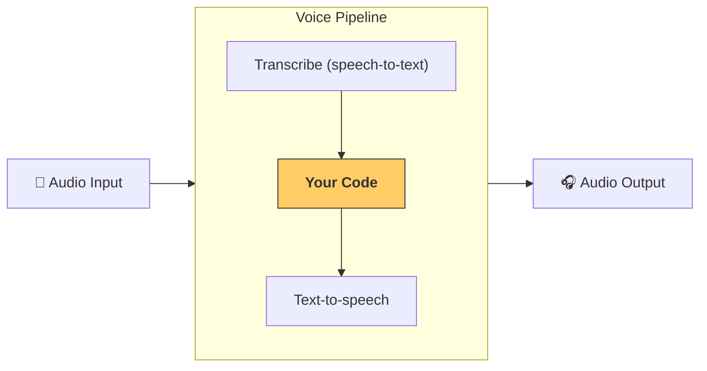

---
search:
  exclude: true
---
# パイプラインとワークフロー

[`VoicePipeline`][agents.voice.pipeline.VoicePipeline] は、エージェント ベースのワークフローを音声アプリに変換しやすくするクラスです。実行するワークフローを渡すと、パイプラインが入力音声の文字起こし、音声の終了検出、適切なタイミングでのワークフロー呼び出し、そしてワークフロー出力の音声への変換までを処理します。



## パイプラインの設定

パイプラインを作成する際、次の項目を設定できます。

1. [`workflow`][agents.voice.workflow.VoiceWorkflowBase]: 新しい音声が文字起こしされるたびに実行されるコードです。
2. 使用する [`speech-to-text`][agents.voice.model.STTModel] と [`text-to-speech`][agents.voice.model.TTSModel] のモデル
3. [`config`][agents.voice.pipeline_config.VoicePipelineConfig]: 次のような設定ができます。
    - モデルプロバイダー。モデル名をモデルにマッピングできます
    - トレーシング（トレーシングの無効化可否、音声ファイルのアップロード有無、ワークフロー名、トレース ID など）
    - TTS と STT のモデルに関する各種設定（プロンプト、言語、使用するデータ型など）

## パイプラインの実行

パイプラインは [`run()`][agents.voice.pipeline.VoicePipeline.run] メソッドで実行できます。音声入力は 2 つの形式で渡せます。

1. [`AudioInput`][agents.voice.input.AudioInput]: 完全な音声の書き起こしがあり、それに対する結果の生成だけを行いたい場合に使います。あらかじめ録音された音声や、ユーザーが話し終えるタイミングが明確なプッシュトゥトーク アプリなど、話者の終了検出が不要なケースに適しています。
2. [`StreamedAudioInput`][agents.voice.input.StreamedAudioInput]: ユーザーが話し終えたタイミングを検出する必要がある場合に使います。検出された音声チャンクをプッシュでき、音声パイプラインは「アクティビティ検出 (activity detection)」と呼ばれるプロセスによって、適切なタイミングでエージェントのワークフローを自動的に実行します。

## 結果

音声パイプラインの実行結果は [`StreamedAudioResult`][agents.voice.result.StreamedAudioResult] です。これは、発生したイベントをストリーミングできるオブジェクトです。いくつかの種類の [`VoiceStreamEvent`][agents.voice.events.VoiceStreamEvent] があります。

1. [`VoiceStreamEventAudio`][agents.voice.events.VoiceStreamEventAudio]: 音声チャンクを含みます。
2. [`VoiceStreamEventLifecycle`][agents.voice.events.VoiceStreamEventLifecycle]: ターンの開始や終了といったライフサイクルイベントを通知します。
3. [`VoiceStreamEventError`][agents.voice.events.VoiceStreamEventError]: エラーイベントです。

```python

result = await pipeline.run(input)

async for event in result.stream():
    if event.type == "voice_stream_event_audio":
        # play audio
    elif event.type == "voice_stream_event_lifecycle":
        # lifecycle
    elif event.type == "voice_stream_event_error"
        # error
    ...
```

## ベストプラクティス

### 割り込み

Agents SDK は現在、[`StreamedAudioInput`][agents.voice.input.StreamedAudioInput] に対するビルトインの割り込み処理をサポートしていません。検出された各ターンごとに、ワークフローの個別の実行がトリガーされます。アプリケーション内で割り込みを扱いたい場合は、[`VoiceStreamEventLifecycle`][agents.voice.events.VoiceStreamEventLifecycle] イベントを監視してください。`turn_started` は新しいターンが文字起こしされ処理が開始したことを示し、`turn_ended` は該当するターンの音声がすべて送出された後に発火します。これらのイベントを用いて、モデルがターンを開始した際に話者のマイクをミュートし、ターンに関連する音声をすべてフラッシュした後にミュート解除する、といった制御が可能です。