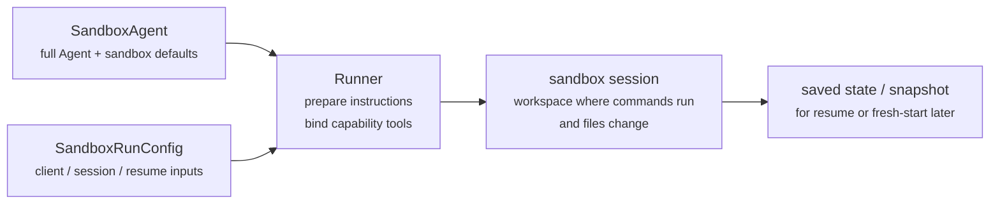

---
search:
  exclude: true
---
# 개념

!!! warning "베타 기능"

    Sandbox 에이전트는 베타입니다. 정식 출시 전에는 API 세부 사항, 기본값, 지원 기능이 변경될 수 있으며, 시간이 지나면서 더 고급 기능이 추가될 수 있습니다

현대적인 에이전트는 파일시스템의 실제 파일을 다룰 수 있을 때 가장 잘 작동합니다. **Sandbox Agents**는 특화된 도구와 셸 명령을 사용해 대규모 문서 집합을 검색하고 조작하며, 파일을 편집하고, 산출물을 생성하고, 명령을 실행할 수 있습니다. 샌드박스는 모델에 영속적인 워크스페이스를 제공하며, 에이전트는 이를 사용해 사용자를 대신해 작업할 수 있습니다. Agents SDK의 Sandbox 에이전트는 샌드박스 환경과 함께 에이전트를 쉽게 실행할 수 있게 도와주며, 파일시스템에 올바른 파일을 배치하고 샌드박스를 오케스트레이션하여 대규모로 작업을 시작, 중지, 재개하기 쉽게 해줍니다

사용자는 에이전트에 필요한 데이터를 중심으로 워크스페이스를 정의합니다. GitHub 저장소, 로컬 파일 및 디렉터리, 합성 작업 파일, S3 또는 Azure Blob Storage 같은 원격 파일시스템, 그리고 사용자가 제공하는 기타 샌드박스 입력에서 시작할 수 있습니다

`SandboxAgent`는 여전히 `Agent`입니다. `instructions`, `prompt`, `tools`, `handoffs`, `mcp_servers`, `model_settings`, `output_type`, 가드레일, 훅 등 일반적인 에이전트 표면을 그대로 유지하며, 일반 `Runner` API를 통해 계속 실행됩니다. 달라지는 점은 실행 경계입니다

- `SandboxAgent`는 에이전트 자체를 정의합니다: 일반적인 에이전트 구성에 더해 `default_manifest`, `base_instructions`, `run_as` 같은 샌드박스 전용 기본값과 파일시스템 도구, 셸 접근, skills, memory, compaction 같은 기능을 포함합니다
- `Manifest`는 새 샌드박스 워크스페이스의 원하는 시작 콘텐츠와 레이아웃을 선언하며, 파일, 저장소, 마운트, 환경을 포함합니다
- 샌드박스 세션은 명령이 실행되고 파일이 변경되는 실제 격리 환경입니다
- [`SandboxRunConfig`][agents.run_config.SandboxRunConfig]는 실행이 해당 샌드박스 세션을 어떻게 얻을지 결정합니다. 예를 들어 세션을 직접 주입하거나, 직렬화된 샌드박스 세션 상태로 재연결하거나, 샌드박스 클라이언트를 통해 새 샌드박스 세션을 생성할 수 있습니다
- 저장된 샌드박스 상태와 스냅샷을 통해 이후 실행에서 이전 작업에 재연결하거나 저장된 콘텐츠로 새 샌드박스 세션을 시드할 수 있습니다

`Manifest`는 새 세션 워크스페이스 계약이지, 모든 라이브 샌드박스의 전체 단일 진실 원천은 아닙니다. 실행의 실제 워크스페이스는 재사용된 샌드박스 세션, 직렬화된 샌드박스 세션 상태, 또는 실행 시점에 선택한 스냅샷에서 대신 올 수 있습니다

이 페이지 전반에서 "sandbox session"은 샌드박스 클라이언트가 관리하는 라이브 실행 환경을 의미합니다. 이는 [Sessions](../sessions/index.md)에서 설명하는 SDK의 대화형 [`Session`][agents.memory.session.Session] 인터페이스와는 다릅니다

외부 런타임은 승인, 트레이싱, 핸드오프, 재개 bookkeeping을 계속 담당합니다. 샌드박스 세션은 명령, 파일 변경, 환경 격리를 담당합니다. 이 분리는 모델의 핵심 요소입니다

### 구성 요소 결합 방식

샌드박스 실행은 에이전트 정의와 실행별 샌드박스 구성을 결합합니다. 러너는 에이전트를 준비하고, 라이브 샌드박스 세션에 바인딩하며, 이후 실행을 위해 상태를 저장할 수 있습니다

샌드박스 전용 기본값은 `SandboxAgent`에 유지됩니다. 실행별 샌드박스 세션 선택은 `SandboxRunConfig`에 유지됩니다

수명주기를 세 단계로 생각해 보세요

1. `SandboxAgent`, `Manifest`, 기능으로 에이전트와 새 워크스페이스 계약을 정의합니다
2. 샌드박스 세션을 주입, 재개, 생성하는 `SandboxRunConfig`를 `Runner`에 전달해 실행합니다
3. 러너가 관리하는 `RunState`, 명시적 샌드박스 `session_state`, 또는 저장된 워크스페이스 스냅샷에서 나중에 이어갑니다

셸 접근이 가끔 쓰는 도구 하나라면 [도구 가이드](../tools.md)의 hosted shell로 시작하세요. 워크스페이스 격리, 샌드박스 클라이언트 선택, 또는 샌드박스 세션 재개 동작이 설계의 일부라면 sandbox 에이전트를 사용하세요

## 사용 시점

sandbox 에이전트는 워크스페이스 중심 워크플로에 잘 맞습니다. 예를 들면 다음과 같습니다

- 코딩과 디버깅: 예를 들어 GitHub 저장소의 이슈 리포트에 대한 자동 수정 오케스트레이션과 타깃 테스트 실행
- 문서 처리 및 편집: 예를 들어 사용자의 금융 문서에서 정보를 추출하고 작성 완료된 세금 양식 초안 생성
- 파일 기반 검토 또는 분석: 예를 들어 답변 전에 온보딩 패킷, 생성된 보고서, 산출물 번들 확인
- 격리된 멀티 에이전트 패턴: 예를 들어 각 리뷰어 또는 코딩 서브 에이전트에 자체 워크스페이스 제공
- 다단계 워크스페이스 작업: 예를 들어 한 실행에서 버그를 수정하고 나중에 회귀 테스트를 추가하거나 스냅샷/샌드박스 세션 상태에서 재개

파일이나 살아 있는 파일시스템 접근이 필요 없다면 계속 `Agent`를 사용하세요. 셸 접근이 가끔 필요한 기능 하나라면 hosted shell을 추가하고, 워크스페이스 경계 자체가 기능의 일부라면 sandbox 에이전트를 사용하세요

## 샌드박스 클라이언트 선택

로컬 개발은 `UnixLocalSandboxClient`로 시작하세요. 컨테이너 격리나 이미지 일치가 필요하면 `DockerSandboxClient`로 이동하세요. 공급자 관리 실행이 필요하면 호스티드 제공자로 이동하세요

대부분의 경우 `SandboxAgent` 정의는 그대로 두고, 샌드박스 클라이언트와 옵션만 [`SandboxRunConfig`][agents.run_config.SandboxRunConfig]에서 변경합니다. 로컬, Docker, 호스티드, 원격 마운트 옵션은 [Sandbox clients](clients.md)를 참고하세요

## 핵심 구성 요소

| 레이어 | 주요 SDK 구성 요소 | 답하는 질문 |
| --- | --- | --- |
| 에이전트 정의 | `SandboxAgent`, `Manifest`, 기능 | 어떤 에이전트가 실행되며, 어떤 새 세션 워크스페이스 계약으로 시작해야 하는가? |
| 샌드박스 실행 | `SandboxRunConfig`, 샌드박스 클라이언트, 라이브 샌드박스 세션 | 이 실행은 라이브 샌드박스 세션을 어떻게 얻고, 작업은 어디서 실행되는가? |
| 저장된 샌드박스 상태 | `RunState` 샌드박스 페이로드, `session_state`, 스냅샷 | 이 워크플로는 이전 샌드박스 작업에 어떻게 재연결하거나 저장된 콘텐츠로 새 샌드박스 세션을 어떻게 시드하는가? |

주요 SDK 구성 요소는 다음과 같이 해당 레이어에 매핑됩니다

| 구성 요소 | 담당 영역 | 이 질문을 하세요 |
| --- | --- | --- |
| [`SandboxAgent`][agents.sandbox.sandbox_agent.SandboxAgent] | 에이전트 정의 | 이 에이전트는 무엇을 해야 하며, 어떤 기본값이 함께 이동해야 하는가? |
| [`Manifest`][agents.sandbox.manifest.Manifest] | 새 세션 워크스페이스 파일 및 폴더 | 실행 시작 시 파일시스템에 어떤 파일과 폴더가 있어야 하는가? |
| [`Capability`][agents.sandbox.capabilities.capability.Capability] | 샌드박스 네이티브 동작 | 어떤 도구, 지시문 조각, 런타임 동작을 이 에이전트에 붙여야 하는가? |
| [`SandboxRunConfig`][agents.run_config.SandboxRunConfig] | 실행별 샌드박스 클라이언트 및 샌드박스 세션 소스 | 이 실행은 샌드박스 세션을 주입, 재개, 생성해야 하는가? |
| [`RunState`][agents.run_state.RunState] | 러너가 관리하는 저장된 샌드박스 상태 | 이전 러너 관리 워크플로를 재개하고 샌드박스 상태를 자동으로 이어받는가? |
| [`SandboxRunConfig.session_state`][agents.run_config.SandboxRunConfig.session_state] | 명시적 직렬화 샌드박스 세션 상태 | 이미 `RunState` 외부에서 직렬화한 샌드박스 상태에서 재개하고 싶은가? |
| [`SandboxRunConfig.snapshot`][agents.run_config.SandboxRunConfig.snapshot] | 새 샌드박스 세션용 저장된 워크스페이스 콘텐츠 | 새 샌드박스 세션을 저장된 파일과 산출물에서 시작해야 하는가? |

실용적인 설계 순서는 다음과 같습니다

1. `Manifest`로 새 세션 워크스페이스 계약 정의
2. `SandboxAgent`로 에이전트 정의
3. 내장 또는 커스텀 기능 추가
4. `RunConfig(sandbox=SandboxRunConfig(...))`에서 각 실행이 샌드박스 세션을 얻는 방식 결정