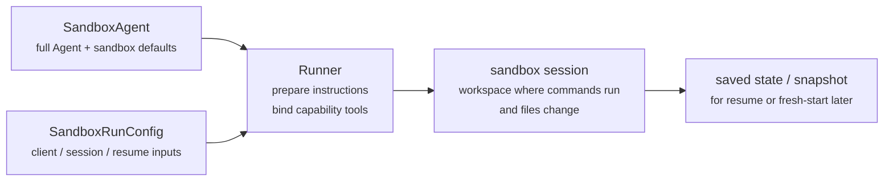
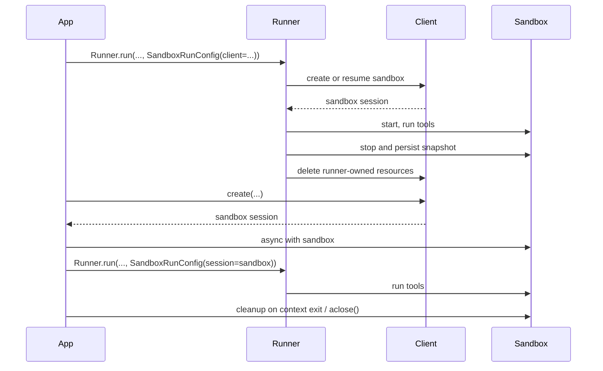

---
search:
  exclude: true
---
# 概念

!!! warning "测试版功能"

    Sandbox Agents 处于测试版。在正式可用前，API 细节、默认值和支持能力可能会变化，并且后续会逐步提供更高级功能。

现代智能体在能够操作文件系统中的真实文件时表现最佳。**Sandbox Agents** 可以使用专用工具和 shell 命令来检索与处理大型文档集、编辑文件、生成产物并执行命令。沙箱为模型提供了一个持久化工作区，智能体可代表你在其中执行任务。Agents SDK 中的 Sandbox Agents 可帮助你轻松运行与沙箱环境配对的智能体，更方便地将正确文件放入文件系统，并对沙箱进行智能体编排，从而轻松地大规模启动、停止和恢复任务。

你可以围绕智能体所需数据定义工作区。它可以从 GitHub 仓库、本地文件与目录、合成任务文件、S3 或 Azure Blob Storage 等远程文件系统，以及你提供的其他沙箱输入开始。

<div class="sandbox-harness-image" markdown="1">


</div>

`SandboxAgent` 仍然是一个 `Agent`。它保留了常见智能体接口，如 `instructions`、`prompt`、`tools`、`handoffs`、`mcp_servers`、`model_settings`、`output_type`、安全防护措施和 hooks，并且仍通过常规 `Runner` API 运行。变化在于执行边界：

- `SandboxAgent` 定义智能体本身：常规智能体配置加上沙箱专属默认项，如 `default_manifest`、`base_instructions`、`run_as`，以及文件系统工具、shell 访问、skills、memory 或 compaction 等能力。
- `Manifest` 声明全新沙箱工作区所需的初始内容与布局，包括文件、仓库、挂载和环境。
- sandbox session 是命令执行与文件变更发生的实时隔离环境。
- [`SandboxRunConfig`][agents.run_config.SandboxRunConfig] 决定本次运行如何获得该 sandbox session，例如直接注入、从序列化的 sandbox session 状态重连，或通过 sandbox client 创建全新的 sandbox session。
- 保存的 sandbox 状态和快照可让后续运行重连先前工作，或从已保存内容为新的 sandbox session 提供初始数据。

`Manifest` 是全新会话工作区契约，而不是每个实时沙箱的完整事实来源。某次运行的实际工作区也可能来自复用的 sandbox session、序列化的 sandbox session 状态，或运行时选择的快照。

在本页中，“sandbox session” 指由 sandbox client 管理的实时执行环境。它不同于 [Sessions](../sessions/index.md) 中描述的 SDK 对话型 [`Session`][agents.memory.session.Session] 接口。

外层运行时仍负责审批、追踪、任务转移和恢复记账。sandbox session 负责命令、文件变更和环境隔离。这种拆分是该模型的核心部分。

### 组件配合方式

一次沙箱运行会将智能体定义与按次运行的沙箱配置结合。runner 会准备智能体、将其绑定到实时 sandbox session，并可为后续运行保存状态。



沙箱专属默认值保留在 `SandboxAgent` 上。每次运行的 sandbox-session 选择保留在 `SandboxRunConfig` 中。

可将生命周期理解为三个阶段：

1. 使用 `SandboxAgent`、`Manifest` 和 capabilities 定义智能体与全新工作区契约。
2. 通过向 `Runner` 提供 `SandboxRunConfig` 来执行运行，以注入、恢复或创建 sandbox session。
3. 后续可从 runner 管理的 `RunState`、显式 sandbox `session_state` 或保存的工作区快照继续。

如果 shell 访问只是偶尔使用的工具，请先使用 [tools guide](../tools.md) 中的托管 shell。若工作区隔离、sandbox client 选择或 sandbox-session 恢复行为是设计的一部分，请使用 sandbox agents。

## 适用场景

Sandbox agents 适合以工作区为中心的工作流，例如：

- 编码与调试，例如为 GitHub 仓库中的 issue 报告编排自动修复并运行定向测试
- 文档处理与编辑，例如从用户财务文档中提取信息并生成已填充的税表草稿
- 基于文件的审阅或分析，例如在答复前检查入职资料包、生成报告或产物包
- 隔离的多智能体模式，例如为每个审阅者或编码子智能体分配独立工作区
- 多步骤工作区任务，例如一次运行修复 bug，后续再添加回归测试，或从快照/沙箱会话状态恢复

如果你不需要访问文件或实时文件系统，请继续使用 `Agent`。如果 shell 访问只是偶发能力，可添加托管 shell；若工作区边界本身就是功能需求，请使用 sandbox agents。

## 选择 sandbox client

本地开发先用 `UnixLocalSandboxClient`。当你需要容器隔离或镜像一致性时切换到 `DockerSandboxClient`。当你需要由提供方管理执行环境时，切换到托管提供方。

多数情况下，`SandboxAgent` 定义保持不变，仅在 [`SandboxRunConfig`][agents.run_config.SandboxRunConfig] 中调整 sandbox client 及其选项。参见 [Sandbox clients](clients.md) 了解本地、Docker、托管和远程挂载选项。

## 核心组件

<div class="sandbox-nowrap-first-column-table" markdown="1">

| 层级 | 主要 SDK 组件 | 回答的问题 |
| --- | --- | --- |
| 智能体定义 | `SandboxAgent`、`Manifest`、capabilities | 将运行什么智能体，以及它应从什么全新会话工作区契约启动？ |
| 沙箱执行 | `SandboxRunConfig`、sandbox client 和实时 sandbox session | 本次运行如何获得实时 sandbox session，工作在何处执行？ |
| 已保存的沙箱状态 | `RunState` 的沙箱负载、`session_state` 和快照 | 该工作流如何重连先前沙箱工作，或从已保存内容为全新 sandbox session 提供初始数据？ |

</div>

主要 SDK 组件与这些层级的映射如下：

<div class="sandbox-nowrap-first-column-table" markdown="1">

| 组件 | 负责内容 | 需要问的问题 |
| --- | --- | --- |
| [`SandboxAgent`][agents.sandbox.sandbox_agent.SandboxAgent] | 智能体定义 | 这个智能体应执行什么，以及哪些默认值应随它一起携带？ |
| [`Manifest`][agents.sandbox.manifest.Manifest] | 全新会话工作区文件与文件夹 | 运行开始时，文件系统中应有哪些文件和文件夹？ |
| [`Capability`][agents.sandbox.capabilities.capability.Capability] | 沙箱原生行为 | 哪些工具、指令片段或运行时行为应附加到该智能体？ |
| [`SandboxRunConfig`][agents.run_config.SandboxRunConfig] | 每次运行的 sandbox client 与 sandbox-session 来源 | 本次运行应注入、恢复还是创建 sandbox session？ |
| [`RunState`][agents.run_state.RunState] | runner 管理的已保存沙箱状态 | 我是否在恢复先前由 runner 管理的工作流，并自动延续其沙箱状态？ |
| [`SandboxRunConfig.session_state`][agents.run_config.SandboxRunConfig.session_state] | 显式序列化的 sandbox session 状态 | 我是否希望从已在 `RunState` 之外序列化的沙箱状态恢复？ |
| [`SandboxRunConfig.snapshot`][agents.run_config.SandboxRunConfig.snapshot] | 用于全新 sandbox session 的已保存工作区内容 | 新 sandbox session 是否应从已保存文件与产物启动？ |

</div>

实用的设计顺序是：

1. 用 `Manifest` 定义全新会话工作区契约。
2. 用 `SandboxAgent` 定义智能体。
3. 添加内置或自定义 capabilities。
4. 在 `RunConfig(sandbox=SandboxRunConfig(...))` 中决定每次运行如何获取 sandbox session。

## 沙箱运行的准备方式

运行时，runner 会将上述定义转换为具体的沙箱支撑运行：

1. 从 `SandboxRunConfig` 解析 sandbox session。  
   若传入 `session=...`，则复用该实时 sandbox session。  
   否则使用 `client=...` 创建或恢复。
2. 确定本次运行的有效工作区输入。  
   若运行注入或恢复了 sandbox session，则以现有沙箱状态为准。  
   否则 runner 从一次性 manifest 覆盖或 `agent.default_manifest` 开始。  
   因此仅靠 `Manifest` 不能定义每次运行的最终实时工作区。
3. 让 capabilities 处理得到的 manifest。  
   capabilities 可在最终智能体准备前添加文件、挂载或其他工作区范围行为。
4. 按固定顺序构建最终 instructions：  
   SDK 默认沙箱提示词，或你显式覆盖时的 `base_instructions`，然后是 `instructions`，接着是 capability 指令片段，再是远程挂载策略文本，最后是渲染后的文件系统树。
5. 将 capability 工具绑定到实时 sandbox session，并通过常规 `Runner` API 运行已准备好的智能体。

沙箱化不会改变 turn 的含义。turn 仍是一次模型步骤，而非单个 shell 命令或沙箱动作。沙箱侧操作与 turn 不存在固定 1:1 映射：有些工作会留在沙箱执行层，另一些动作会返回工具结果、审批或其他状态，从而需要下一次模型步骤。实践上，只有当智能体运行时在沙箱工作发生后需要新的模型响应时，才会消耗下一次 turn。

因此在设计 `SandboxAgent` 时，`default_manifest`、`instructions`、`base_instructions`、`capabilities` 和 `run_as` 是主要需要考虑的沙箱专属选项。

## `SandboxAgent` 选项

以下是在常规 `Agent` 字段之上的沙箱专属选项：

<div class="sandbox-nowrap-first-column-table" markdown="1">

| 选项 | 最佳用途 |
| --- | --- |
| `default_manifest` | runner 创建全新 sandbox session 时的默认工作区。 |
| `instructions` | 追加在 SDK 沙箱提示词后的角色、流程和成功标准。 |
| `base_instructions` | 用于替换 SDK 沙箱提示词的高级逃生口。 |
| `capabilities` | 应随该智能体携带的沙箱原生工具与行为。 |
| `run_as` | 面向模型的沙箱工具（如 shell 命令、文件读取、补丁）使用的用户身份。 |

</div>

sandbox client 选择、sandbox-session 复用、manifest 覆盖和快照选择应放在 [`SandboxRunConfig`][agents.run_config.SandboxRunConfig] 中，而不是智能体上。

### `default_manifest`

`default_manifest` 是当 runner 为该智能体创建全新 sandbox session 时使用的默认 [`Manifest`][agents.sandbox.manifest.Manifest]。可用于定义智能体通常应具备的文件、仓库、辅助材料、输出目录和挂载。

这只是默认值。运行可通过 `SandboxRunConfig(manifest=...)` 覆盖；若复用或恢复 sandbox session，则保留其现有工作区状态。

### `instructions` 与 `base_instructions`

对需跨不同提示保持稳定的简短规则，请使用 `instructions`。在 `SandboxAgent` 中，这些 instructions 会追加在 SDK 的沙箱基础提示词之后，因此你可保留内置沙箱指导，并添加自己的角色、流程和成功标准。

仅当你想替换 SDK 沙箱基础提示词时才使用 `base_instructions`。多数智能体不应设置它。

<div class="sandbox-nowrap-first-column-table" markdown="1">

| 放在... | 用途 | 示例 |
| --- | --- | --- |
| `instructions` | 智能体的稳定角色、流程规则与成功标准。 | “检查入职文档，然后任务转移。”、“将最终文件写入 `output/`。” |
| `base_instructions` | 对 SDK 沙箱基础提示词的完整替换。 | 自定义低层沙箱包装提示词。 |
| 用户提示词 | 本次运行的一次性请求。 | “总结这个工作区。” |
| manifest 中的工作区文件 | 更长的任务规格、仓库本地说明或有界参考材料。 | `repo/task.md`、文档包、示例资料包。 |

</div>

`instructions` 的良好用法包括：

- [examples/sandbox/unix_local_pty.py](https://github.com/openai/openai-agents-python/blob/main/examples/sandbox/unix_local_pty.py) 在 PTY 状态重要时让智能体保持在同一交互进程中。
- [examples/sandbox/handoffs.py](https://github.com/openai/openai-agents-python/blob/main/examples/sandbox/handoffs.py) 禁止沙箱审阅智能体在检查后直接答复用户。
- [examples/sandbox/tax_prep.py](https://github.com/openai/openai-agents-python/blob/main/examples/sandbox/tax_prep.py) 要求最终填写文件必须实际落盘到 `output/`。
- [examples/sandbox/docs/coding_task.py](https://github.com/openai/openai-agents-python/blob/main/examples/sandbox/docs/coding_task.py) 固定精确验证命令，并明确相对工作区根目录的补丁路径。

避免将用户一次性任务复制到 `instructions`、嵌入应放入 manifest 的长参考材料、重复内置 capabilities 已注入的工具文档，或混入模型在运行时不需要的本地安装说明。

若省略 `instructions`，SDK 仍会包含默认沙箱提示词。这对低层包装器已足够，但多数面向用户的智能体仍应提供明确 `instructions`。

### `capabilities`

capabilities 会为 `SandboxAgent` 附加沙箱原生行为。它们可在运行开始前塑造工作区、追加沙箱专属 instructions、暴露绑定到实时 sandbox session 的工具，并调整该智能体的模型行为或输入处理。

内置 capabilities 包括：

<div class="sandbox-nowrap-first-column-table" markdown="1">

| Capability | 添加时机 | 说明 |
| --- | --- | --- |
| `Shell` | 智能体需要 shell 访问时。 | 添加 `exec_command`，且当 sandbox client 支持 PTY 交互时添加 `write_stdin`。 |
| `Filesystem` | 智能体需要编辑文件或检查本地图像时。 | 添加 `apply_patch` 和 `view_image`；补丁路径相对工作区根目录。 |
| `Skills` | 你希望在沙箱中进行 skill 发现与实体化时。 | 对沙箱本地 `SKILL.md` skills，优先使用该能力而非手动挂载 `.agents` 或 `.agents/skills`。 |
| `Memory` | 后续运行应读取或生成 memory 产物时。 | 需要 `Shell`；实时更新还需要 `Filesystem`。 |
| `Compaction` | 长流程在压缩项后需要上下文裁剪时。 | 调整模型采样与输入处理。 |

</div>

默认情况下，`SandboxAgent.capabilities` 使用 `Capabilities.default()`，包含 `Filesystem()`、`Shell()` 和 `Compaction()`。若传入 `capabilities=[...]`，该列表会替换默认值，因此请包含你仍需要的默认能力。

对于 skills，请按实体化方式选择来源：

- `Skills(lazy_from=LocalDirLazySkillSource(...))` 适合较大的本地技能目录，模型可先发现索引，仅加载所需内容。
- `Skills(from_=LocalDir(src=...))` 适合希望预先分发的小型本地技能包。
- `Skills(from_=GitRepo(repo=..., ref=...))` 适合技能本身来自仓库的场景。

若你的 skills 已位于磁盘路径如 `.agents/skills/<name>/SKILL.md` 下，请将 `LocalDir(...)` 指向该源根目录，并仍使用 `Skills(...)` 暴露它们。除非已有工作区契约依赖其他沙箱内布局，否则保持默认 `skills_path=".agents"`。

内置 capabilities 能满足需求时应优先使用。仅当你需要内置能力未覆盖的沙箱专属工具或指令面时，才编写自定义 capability。

## 概念

### Manifest

[`Manifest`][agents.sandbox.manifest.Manifest] 描述全新 sandbox session 的工作区。它可设置工作区 `root`、声明文件与目录、拷入本地文件、克隆 Git 仓库、附加远程存储挂载、设置环境变量并定义用户或组。

Manifest 条目路径是相对工作区的。它们不能是绝对路径，也不能通过 `..` 逃离工作区，这保证了工作区契约在本地、Docker 与托管 client 之间的可移植性。

对于开工前智能体所需材料，请使用 manifest 条目：

<div class="sandbox-nowrap-first-column-table" markdown="1">

| Manifest 条目 | 用途 |
| --- | --- |
| `File`、`Dir` | 小型合成输入、辅助文件或输出目录。 |
| `LocalFile`、`LocalDir` | 需要实体化到沙箱中的主机文件或目录。 |
| `GitRepo` | 应拉取到工作区的仓库。 |
| 挂载（如 `S3Mount`、`GCSMount`、`R2Mount`、`AzureBlobMount`、`S3FilesMount`） | 应出现在沙箱内的外部存储。 |

</div>

挂载条目描述要暴露的存储；挂载策略描述沙箱后端如何附加该存储。参见 [Sandbox clients](clients.md#mounts-and-remote-storage) 获取挂载选项和提供方支持。

良好的 manifest 设计通常意味着收窄工作区契约、将长任务配方放入 `repo/task.md` 等工作区文件，并在 instructions 中使用相对工作区路径，例如 `repo/task.md` 或 `output/report.md`。若智能体用 `Filesystem` capability 的 `apply_patch` 工具编辑文件，请记住补丁路径相对沙箱工作区根目录，而不是 shell 的 `workdir`。

### 权限

`Permissions` 控制 manifest 条目的文件系统权限。它针对沙箱实体化的文件，不涉及模型权限、审批策略或 API 凭据。

默认情况下，manifest 条目对所有者可读/可写/可执行，对组和其他用户可读/可执行。当分发文件应为私有、只读或可执行时请覆盖：

```python
from agents.sandbox import FileMode, Permissions
from agents.sandbox.entries import File

private_notes = File(
    text="internal notes",
    permissions=Permissions(
        owner=FileMode.READ | FileMode.WRITE,
        group=FileMode.NONE,
        other=FileMode.NONE,
    ),
)
```

`Permissions` 存储独立的 owner、group 和 other 位，以及条目是否为目录。你可以直接构建它、通过 `Permissions.from_str(...)` 从模式字符串解析，或通过 `Permissions.from_mode(...)` 从 OS 模式推导。

用户是可在沙箱中执行工作的身份。若你希望某身份存在于沙箱中，请向 manifest 添加 `User`；随后当面向模型的沙箱工具（如 shell 命令、文件读取、补丁）应以该用户运行时，设置 `SandboxAgent.run_as`。若 `run_as` 指向 manifest 中尚不存在的用户，runner 会将其加入有效 manifest。

```python
from agents import Runner
from agents.run import RunConfig
from agents.sandbox import FileMode, Manifest, Permissions, SandboxAgent, SandboxRunConfig, User
from agents.sandbox.entries import Dir, LocalDir
from agents.sandbox.sandboxes.unix_local import UnixLocalSandboxClient

analyst = User(name="analyst")

agent = SandboxAgent(
    name="Dataroom analyst",
    instructions="Review the files in `dataroom/` and write findings to `output/`.",
    default_manifest=Manifest(
        # Declare the sandbox user so manifest entries can grant access to it.
        users=[analyst],
        entries={
            "dataroom": LocalDir(
                src="./dataroom",
                # Let the analyst traverse and read the mounted dataroom, but not edit it.
                group=analyst,
                permissions=Permissions(
                    owner=FileMode.READ | FileMode.EXEC,
                    group=FileMode.READ | FileMode.EXEC,
                    other=FileMode.NONE,
                ),
            ),
            "output": Dir(
                # Give the analyst a writable scratch/output directory for artifacts.
                group=analyst,
                permissions=Permissions(
                    owner=FileMode.ALL,
                    group=FileMode.ALL,
                    other=FileMode.NONE,
                ),
            ),
        },
    ),
    # Run model-facing sandbox actions as this user, so those permissions apply.
    run_as=analyst,
)

result = await Runner.run(
    agent,
    "Summarize the contracts and call out renewal dates.",
    run_config=RunConfig(
        sandbox=SandboxRunConfig(client=UnixLocalSandboxClient()),
    ),
)
```

若你还需要文件级共享规则，可将用户与 manifest 组以及条目 `group` 元数据结合使用。`run_as` 用户控制谁执行沙箱原生动作；`Permissions` 控制沙箱实体化工作区后，该用户可读取、写入或执行哪些文件。

### SnapshotSpec

`SnapshotSpec` 告诉全新 sandbox session 从哪里恢复已保存工作区内容并回写到哪里。它是沙箱工作区的快照策略，而 `session_state` 是用于恢复特定沙箱后端的序列化连接状态。

本地持久快照使用 `LocalSnapshotSpec`；当你的应用提供远程快照 client 时使用 `RemoteSnapshotSpec`。当本地快照设置不可用时，会回退到 no-op 快照；高级调用方也可在不希望工作区快照持久化时显式使用 no-op 快照。

```python
from pathlib import Path

from agents.run import RunConfig
from agents.sandbox import LocalSnapshotSpec, SandboxRunConfig
from agents.sandbox.sandboxes.unix_local import UnixLocalSandboxClient

run_config = RunConfig(
    sandbox=SandboxRunConfig(
        client=UnixLocalSandboxClient(),
        snapshot=LocalSnapshotSpec(base_path=Path("/tmp/my-sandbox-snapshots")),
    )
)
```

当 runner 创建全新 sandbox session 时，sandbox client 会为该会话构建快照实例。启动时若快照可恢复，沙箱会在运行继续前恢复已保存工作区内容。清理时，runner 持有的 sandbox session 会归档工作区，并通过快照回持久化。

若省略 `snapshot`，运行时会尽可能使用默认本地快照位置。若无法设置，则回退到 no-op 快照。挂载路径和临时路径不会作为持久工作区内容复制进快照。

### 沙箱生命周期

有两种生命周期模式：**SDK-owned** 与 **developer-owned**。

<div class="sandbox-lifecycle-diagram" markdown="1">



</div>

当沙箱只需存活一次运行时，使用 SDK-owned 生命周期。传入 `client`、可选 `manifest`、可选 `snapshot` 与 client `options`；runner 会创建或恢复沙箱、启动它、运行智能体、持久化快照支持的工作区状态、关闭沙箱，并让 client 清理 runner 持有资源。

```python
result = await Runner.run(
    agent,
    "Inspect the workspace and summarize what changed.",
    run_config=RunConfig(
        sandbox=SandboxRunConfig(client=UnixLocalSandboxClient()),
    ),
)
```

当你希望预先创建沙箱、在多次运行间复用同一实时沙箱、运行后检查文件、在你自己创建的沙箱上进行流式处理，或精确决定清理时机时，使用 developer-owned 生命周期。传入 `session=...` 会让 runner 使用该实时沙箱，但不会代你关闭它。

```python
sandbox = await client.create(manifest=agent.default_manifest)

async with sandbox:
    run_config = RunConfig(sandbox=SandboxRunConfig(session=sandbox))
    await Runner.run(agent, "Analyze the files.", run_config=run_config)
    await Runner.run(agent, "Write the final report.", run_config=run_config)
```

上下文管理器是常见形态：进入时启动沙箱，退出时执行会话清理生命周期。若你的应用无法使用上下文管理器，请直接调用生命周期方法：

```python
sandbox = await client.create(
    manifest=agent.default_manifest,
    snapshot=LocalSnapshotSpec(base_path=Path("/tmp/my-sandbox-snapshots")),
)
try:
    await sandbox.start()
    await Runner.run(
        agent,
        "Analyze the files.",
        run_config=RunConfig(sandbox=SandboxRunConfig(session=sandbox)),
    )
    # Persist a checkpoint of the live workspace before doing more work.
    # `aclose()` also calls `stop()`, so this is only needed for an explicit mid-lifecycle save.
    await sandbox.stop()
finally:
    await sandbox.aclose()
```

`stop()` 仅持久化快照支持的工作区内容；不会拆除沙箱。`aclose()` 是完整会话清理路径：运行停止前 hooks、调用 `stop()`、关闭沙箱资源，并关闭会话范围依赖。

## `SandboxRunConfig` 选项

[`SandboxRunConfig`][agents.run_config.SandboxRunConfig] 保存按次运行选项，用于决定 sandbox session 来源及全新会话初始化方式。

### 沙箱来源

这些选项决定 runner 应复用、恢复还是创建 sandbox session：

<div class="sandbox-nowrap-first-column-table" markdown="1">

| 选项 | 使用场景 | 说明 |
| --- | --- | --- |
| `client` | 你希望 runner 为你创建、恢复并清理 sandbox session。 | 除非提供实时 sandbox `session`，否则必填。 |
| `session` | 你已自行创建实时 sandbox session。 | 生命周期由调用方负责；runner 复用该实时 sandbox session。 |
| `session_state` | 你有序列化的 sandbox session 状态，但没有实时 sandbox session 对象。 | 需要 `client`；runner 会从该显式状态恢复为持有型会话。 |

</div>

实践中，runner 按如下顺序解析 sandbox session：

1. 若注入 `run_config.sandbox.session`，则直接复用该实时 sandbox session。
2. 否则，若运行从 `RunState` 恢复，则恢复存储的 sandbox session 状态。
3. 否则，若传入 `run_config.sandbox.session_state`，runner 从该显式序列化状态恢复。
4. 否则，runner 创建全新 sandbox session。对该全新会话，若提供则使用 `run_config.sandbox.manifest`，否则使用 `agent.default_manifest`。

### 全新会话输入

这些选项仅在 runner 创建全新 sandbox session 时生效：

<div class="sandbox-nowrap-first-column-table" markdown="1">

| 选项 | 使用场景 | 说明 |
| --- | --- | --- |
| `manifest` | 你希望一次性覆盖全新会话工作区。 | 省略时回退到 `agent.default_manifest`。 |
| `snapshot` | 全新 sandbox session 应从快照提供初始数据。 | 适用于类恢复流程或远程快照 client。 |
| `options` | sandbox client 需要创建时选项。 | 常见于 Docker 镜像、Modal 应用名、E2B 模板、超时及类似 client 专属设置。 |

</div>

### 实体化控制

`concurrency_limits` 控制沙箱实体化工作可并行运行的规模。当大型 manifest 或本地目录复制需要更严格资源控制时，使用 `SandboxConcurrencyLimits(manifest_entries=..., local_dir_files=...)`。将任一值设为 `None` 可禁用该项限制。

有几点影响值得注意：

- 全新会话：`manifest=` 与 `snapshot=` 仅在 runner 创建全新 sandbox session 时生效。
- 恢复 vs 快照：`session_state=` 重连到先前序列化的沙箱状态，而 `snapshot=` 从已保存工作区内容为新 sandbox session 提供初始数据。
- client 专属选项：`options=` 取决于 sandbox client；Docker 和许多托管 client 需要它。
- 注入实时会话：若传入运行中的 sandbox `session`，由 capability 驱动的 manifest 更新可添加兼容的非挂载条目。它们不能更改 `manifest.root`、`manifest.environment`、`manifest.users` 或 `manifest.groups`；不能删除现有条目；不能替换条目类型；也不能添加或更改挂载条目。
- Runner API：`SandboxAgent` 执行仍使用常规 `Runner.run()`、`Runner.run_sync()` 和 `Runner.run_streamed()` API。

## 完整示例：编码任务

此编码风格示例是一个良好的默认起点：

```python
import asyncio
from pathlib import Path

from agents import ModelSettings, Runner
from agents.run import RunConfig
from agents.sandbox import Manifest, SandboxAgent, SandboxRunConfig
from agents.sandbox.capabilities import (
    Capabilities,
    LocalDirLazySkillSource,
    Skills,
)
from agents.sandbox.entries import LocalDir
from agents.sandbox.sandboxes.unix_local import UnixLocalSandboxClient

EXAMPLE_DIR = Path(__file__).resolve().parent
HOST_REPO_DIR = EXAMPLE_DIR / "repo"
HOST_SKILLS_DIR = EXAMPLE_DIR / "skills"
TARGET_TEST_CMD = "sh tests/test_credit_note.sh"


def build_agent(model: str) -> SandboxAgent[None]:
    return SandboxAgent(
        name="Sandbox engineer",
        model=model,
        instructions=(
            "Inspect the repo, make the smallest correct change, run the most relevant checks, "
            "and summarize the file changes and risks. "
            "Read `repo/task.md` before editing files. Stay grounded in the repository, preserve "
            "existing behavior, and mention the exact verification command you ran. "
            "Use the `$credit-note-fixer` skill before editing files. If the repo lives under "
            "`repo/`, remember that `apply_patch` paths stay relative to the sandbox workspace "
            "root, so edits still target `repo/...`."
        ),
        # Put repos and task files in the manifest.
        default_manifest=Manifest(
            entries={
                "repo": LocalDir(src=HOST_REPO_DIR),
            }
        ),
        capabilities=Capabilities.default() + [
            # Let Skills(...) stage and index sandbox-local skills for you.
            Skills(
                lazy_from=LocalDirLazySkillSource(
                    source=LocalDir(src=HOST_SKILLS_DIR),
                )
            ),
        ],
        model_settings=ModelSettings(tool_choice="required"),
    )


async def main(model: str, prompt: str) -> None:
    result = await Runner.run(
        build_agent(model),
        prompt,
        run_config=RunConfig(
            sandbox=SandboxRunConfig(client=UnixLocalSandboxClient()),
            workflow_name="Sandbox coding example",
        ),
    )
    print(result.final_output)


if __name__ == "__main__":
    asyncio.run(
        main(
            model="gpt-5.4",
            prompt=(
                "Open `repo/task.md`, use the `$credit-note-fixer` skill, fix the bug, "
                f"run `{TARGET_TEST_CMD}`, and summarize the change."
            ),
        )
    )
```

参见 [examples/sandbox/docs/coding_task.py](https://github.com/openai/openai-agents-python/blob/main/examples/sandbox/docs/coding_task.py)。它使用一个微型 shell 仓库，以便在 Unix 本地运行中可确定性验证。你的真实任务仓库当然可以是 Python、JavaScript 或其他任何技术栈。

## 常见模式

从上方完整示例开始。在很多情况下，同一个 `SandboxAgent` 可保持不变，只需更改 sandbox client、sandbox-session 来源或工作区来源。

### 切换 sandbox clients

保持智能体定义不变，仅更改 run config。需要容器隔离或镜像一致性时使用 Docker；需要提供方托管执行时使用托管提供方。示例和提供方选项见 [Sandbox clients](clients.md)。

### 覆盖工作区

保持智能体定义不变，仅替换全新会话 manifest：

```python
from agents.run import RunConfig
from agents.sandbox import Manifest, SandboxRunConfig
from agents.sandbox.entries import GitRepo
from agents.sandbox.sandboxes.unix_local import UnixLocalSandboxClient

run_config = RunConfig(
    sandbox=SandboxRunConfig(
        client=UnixLocalSandboxClient(),
        manifest=Manifest(
            entries={
                "repo": GitRepo(repo="openai/openai-agents-python", ref="main"),
            }
        ),
    ),
)
```

当同一智能体角色需在不同仓库、资料包或任务包上运行且无需重建智能体时使用。上方可验证的编码示例展示了同一模式，只是用的是 `default_manifest` 而非一次性覆盖。

### 注入 sandbox session

当你需要显式生命周期控制、运行后检查或输出复制时，注入实时 sandbox session：

```python
from agents import Runner
from agents.run import RunConfig
from agents.sandbox import SandboxRunConfig
from agents.sandbox.sandboxes.unix_local import UnixLocalSandboxClient

client = UnixLocalSandboxClient()
sandbox = await client.create(manifest=agent.default_manifest)

async with sandbox:
    result = await Runner.run(
        agent,
        prompt,
        run_config=RunConfig(
            sandbox=SandboxRunConfig(session=sandbox),
        ),
    )
```

当你希望在运行后检查工作区，或在已启动的 sandbox session 上进行流式处理时使用。参见 [examples/sandbox/docs/coding_task.py](https://github.com/openai/openai-agents-python/blob/main/examples/sandbox/docs/coding_task.py) 与 [examples/sandbox/docker/docker_runner.py](https://github.com/openai/openai-agents-python/blob/main/examples/sandbox/docker/docker_runner.py)。

### 从 session state 恢复

若你已在 `RunState` 外序列化沙箱状态，让 runner 从该状态重连：

```python
from agents.run import RunConfig
from agents.sandbox import SandboxRunConfig

serialized = load_saved_payload()
restored_state = client.deserialize_session_state(serialized)

run_config = RunConfig(
    sandbox=SandboxRunConfig(
        client=client,
        session_state=restored_state,
    ),
)
```

当沙箱状态位于你自己的存储或作业系统中，并希望 `Runner` 直接从中恢复时使用。序列化/反序列化流程见 [examples/sandbox/extensions/blaxel_runner.py](https://github.com/openai/openai-agents-python/blob/main/examples/sandbox/extensions/blaxel_runner.py)。

### 从快照启动

从已保存文件与产物为新沙箱提供初始数据：

```python
from pathlib import Path

from agents.run import RunConfig
from agents.sandbox import LocalSnapshotSpec, SandboxRunConfig
from agents.sandbox.sandboxes.unix_local import UnixLocalSandboxClient

run_config = RunConfig(
    sandbox=SandboxRunConfig(
        client=UnixLocalSandboxClient(),
        snapshot=LocalSnapshotSpec(base_path=Path("/tmp/my-sandbox-snapshot")),
    ),
)
```

当全新运行应从已保存工作区内容启动，而非仅依赖 `agent.default_manifest` 时使用。本地快照流程见 [examples/sandbox/memory.py](https://github.com/openai/openai-agents-python/blob/main/examples/sandbox/memory.py)，远程快照 client 见 [examples/sandbox/sandbox_agent_with_remote_snapshot.py](https://github.com/openai/openai-agents-python/blob/main/examples/sandbox/sandbox_agent_with_remote_snapshot.py)。

### 从 Git 加载 skills

将本地 skill 来源替换为仓库支持的来源：

```python
from agents.sandbox.capabilities import Capabilities, Skills
from agents.sandbox.entries import GitRepo

capabilities = Capabilities.default() + [
    Skills(from_=GitRepo(repo="sdcoffey/tax-prep-skills", ref="main")),
]
```

当 skills 包有自己的发布节奏，或应在多个沙箱间共享时使用。参见 [examples/sandbox/tax_prep.py](https://github.com/openai/openai-agents-python/blob/main/examples/sandbox/tax_prep.py)。

### 作为工具暴露

工具智能体可以拥有自己的沙箱边界，也可以复用父运行中的实时沙箱。复用适合快速只读探索智能体：它可检查父级正在使用的精确工作区，而无需创建、注水或快照另一个沙箱的成本。

```python
from agents import Runner
from agents.run import RunConfig
from agents.sandbox import FileMode, Manifest, Permissions, SandboxAgent, SandboxRunConfig, User
from agents.sandbox.entries import Dir, File
from agents.sandbox.sandboxes.unix_local import UnixLocalSandboxClient

coordinator = User(name="coordinator")
explorer = User(name="explorer")

manifest = Manifest(
    users=[coordinator, explorer],
    entries={
        "pricing_packet": Dir(
            group=coordinator,
            permissions=Permissions(
                owner=FileMode.ALL,
                group=FileMode.ALL,
                other=FileMode.READ | FileMode.EXEC,
                directory=True,
            ),
            children={
                "pricing.md": File(
                    content=b"Pricing packet contents...",
                    group=coordinator,
                    permissions=Permissions(
                        owner=FileMode.ALL,
                        group=FileMode.ALL,
                        other=FileMode.READ,
                    ),
                ),
            },
        ),
        "work": Dir(
            group=coordinator,
            permissions=Permissions(
                owner=FileMode.ALL,
                group=FileMode.ALL,
                other=FileMode.NONE,
                directory=True,
            ),
        ),
    },
)

pricing_explorer = SandboxAgent(
    name="Pricing Explorer",
    instructions="Read `pricing_packet/` and summarize commercial risk. Do not edit files.",
    run_as=explorer,
)

client = UnixLocalSandboxClient()
sandbox = await client.create(manifest=manifest)

async with sandbox:
    shared_run_config = RunConfig(
        sandbox=SandboxRunConfig(session=sandbox),
    )

    orchestrator = SandboxAgent(
        name="Revenue Operations Coordinator",
        instructions="Coordinate the review and write final notes to `work/`.",
        run_as=coordinator,
        tools=[
            pricing_explorer.as_tool(
                tool_name="review_pricing_packet",
                tool_description="Inspect the pricing packet and summarize commercial risk.",
                run_config=shared_run_config,
                max_turns=2,
            ),
        ],
    )

    result = await Runner.run(
        orchestrator,
        "Review the pricing packet, then write final notes to `work/summary.md`.",
        run_config=shared_run_config,
    )
```

这里父智能体以 `coordinator` 身份运行，探索工具智能体以 `explorer` 身份在同一实时 sandbox session 内运行。`pricing_packet/` 条目对 `other` 用户可读，因此 explorer 可快速检查，但没有写权限。`work/` 目录仅对 coordinator 的用户/组可用，因此父级可写入最终产物，而 explorer 保持只读。

当工具智能体确实需要隔离时，请为其提供独立的沙箱 `RunConfig`：

```python
from docker import from_env as docker_from_env

from agents.run import RunConfig
from agents.sandbox import SandboxRunConfig
from agents.sandbox.sandboxes.docker import DockerSandboxClient, DockerSandboxClientOptions

rollout_agent.as_tool(
    tool_name="review_rollout_risk",
    tool_description="Inspect the rollout packet and summarize implementation risk.",
    run_config=RunConfig(
        sandbox=SandboxRunConfig(
            client=DockerSandboxClient(docker_from_env()),
            options=DockerSandboxClientOptions(image="python:3.14-slim"),
        ),
    ),
)
```

当工具智能体应自由修改、运行不受信任命令，或使用不同后端/镜像时，使用独立沙箱。参见 [examples/sandbox/sandbox_agents_as_tools.py](https://github.com/openai/openai-agents-python/blob/main/examples/sandbox/sandbox_agents_as_tools.py)。

### 与本地工具和 MCP 结合

在保留沙箱工作区的同时，仍在同一智能体上使用普通工具：

```python
from agents.sandbox import SandboxAgent
from agents.sandbox.capabilities import Shell

agent = SandboxAgent(
    name="Workspace reviewer",
    instructions="Inspect the workspace and call host tools when needed.",
    tools=[get_discount_approval_path],
    mcp_servers=[server],
    capabilities=[Shell()],
)
```

当工作区检查只是智能体任务的一部分时使用。参见 [examples/sandbox/sandbox_agent_with_tools.py](https://github.com/openai/openai-agents-python/blob/main/examples/sandbox/sandbox_agent_with_tools.py)。

## Memory

当未来 sandbox-agent 运行需要从先前运行学习时，使用 `Memory` capability。Memory 与 SDK 的对话型 `Session` 记忆分离：它将经验提炼为沙箱工作区中的文件，后续运行可读取这些文件。

设置、读/生成功能、多轮对话与布局隔离，见 [Agent memory](memory.md)。

## 组合模式

当单智能体模式清晰后，下一个设计问题是在更大系统中将沙箱边界放在哪里。

Sandbox agents 仍可与 SDK 其余部分组合：

- [Handoffs](../handoffs.md)：将文档密集工作从非沙箱入口智能体任务转移给沙箱审阅智能体。
- [Agents as tools](../tools.md#agents-as-tools)：将多个 sandbox agents 作为工具暴露，通常是在每次 `Agent.as_tool(...)` 调用上通过 `run_config=RunConfig(sandbox=SandboxRunConfig(...))` 传参，使每个工具都有自己的沙箱边界。
- [MCP](../mcp.md) 与普通工具调用：沙箱 capabilities 可与 `mcp_servers` 和普通 Python 工具并存。
- [Running agents](../running_agents.md)：沙箱运行仍使用常规 `Runner` API。

两种模式尤其常见：

- 非沙箱智能体仅在需要工作区隔离的流程部分任务转移到沙箱智能体
- 编排器将多个 sandbox agents 作为工具暴露，通常每次 `Agent.as_tool(...)` 调用都使用独立沙箱 `RunConfig`，使每个工具拥有独立隔离工作区

### Turn 与沙箱运行

分别解释 handoff 与 agent-as-tool 调用会更清楚。

在 handoff 中，仍然只有一个顶层运行和一个顶层 turn 循环。活跃智能体会变化，但运行不会嵌套。如果非沙箱入口智能体任务转移给沙箱审阅智能体，那么同一运行中的下一次模型调用会为沙箱智能体准备，并由其执行下一次 turn。换言之，handoff 改变的是同一次运行中“谁拥有下一次 turn”。参见 [examples/sandbox/handoffs.py](https://github.com/openai/openai-agents-python/blob/main/examples/sandbox/handoffs.py)。

使用 `Agent.as_tool(...)` 时关系不同。外层编排器用一次外层 turn 决定调用该工具，而该工具调用会为沙箱智能体启动一个嵌套运行。嵌套运行有自己的 turn 循环、`max_turns`、审批，且通常有自己的沙箱 `RunConfig`。它可能在一次嵌套 turn 完成，也可能需要多次。从外层编排器视角看，这些工作仍位于一次工具调用之后，因此嵌套 turns 不会增加外层运行的 turn 计数。参见 [examples/sandbox/sandbox_agents_as_tools.py](https://github.com/openai/openai-agents-python/blob/main/examples/sandbox/sandbox_agents_as_tools.py)。

审批行为遵循同样拆分：

- 对 handoff，审批保留在同一顶层运行上，因为沙箱智能体现在是该运行中的活跃智能体
- 对 `Agent.as_tool(...)`，在沙箱工具智能体内触发的审批仍会呈现在外层运行上，但它们来自已存储的嵌套运行状态，并在外层运行恢复时继续嵌套沙箱运行

## 延伸阅读

- [Quickstart](quickstart.md)：运行一个 sandbox agent。
- [Sandbox clients](clients.md)：选择本地、Docker、托管和挂载选项。
- [Agent memory](memory.md)：保留并复用先前沙箱运行经验。
- [examples/sandbox/](https://github.com/openai/openai-agents-python/tree/main/examples/sandbox)：可运行的本地、编码、memory、handoff 和智能体组合模式。