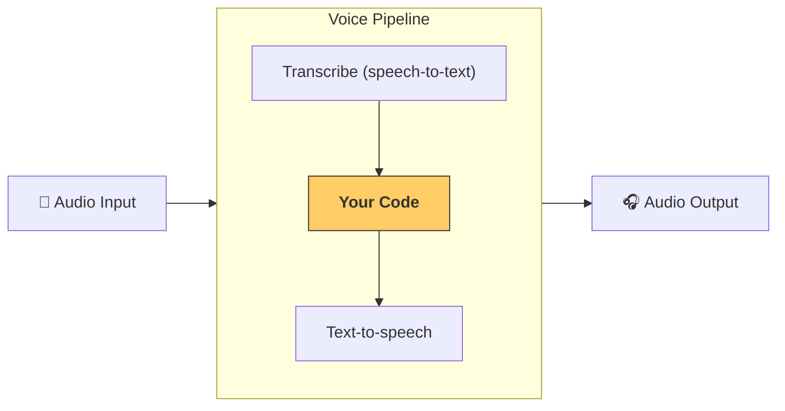

---
search:
  exclude: true
---
# 流水线与工作流

[`VoicePipeline`][agents.voice.pipeline.VoicePipeline] 是一个类，可将你的智能体工作流轻松变成语音应用。你传入要运行的工作流，流水线会负责转写输入音频、检测音频何时结束、在合适的时机调用你的工作流，并将工作流输出转换回音频。



## 配置流水线

创建流水线时，你可以设置以下内容：

1. [`workflow`][agents.voice.workflow.VoiceWorkflowBase]：每次有新音频被转写时运行的代码。
2. 使用的 [`speech-to-text`][agents.voice.model.STTModel] 和 [`text-to-speech`][agents.voice.model.TTSModel] 模型
3. [`config`][agents.voice.pipeline_config.VoicePipelineConfig]：用于配置以下内容：
    - 模型提供器，可将模型名称映射到具体模型
    - 追踪，包括是否禁用追踪、是否上传音频文件、工作流名称、追踪 ID 等
    - TTS 与 STT 模型的设置，如提示词、语言和所用数据类型

## 运行流水线

你可以通过 [`run()`][agents.voice.pipeline.VoicePipeline.run] 方法运行流水线，它允许你以两种形式传入音频输入：

1. 当你已有完整的音频转录文本，并只想为其生成结果时，使用 [`AudioInput`][agents.voice.input.AudioInput]。这在你不需要检测说话者何时说完的场景很有用；例如，预录音频，或在按住说话的应用中能够明确识别用户何时说完。
2. 当你可能需要检测用户何时说完时，使用 [`StreamedAudioInput`][agents.voice.input.StreamedAudioInput]。它允许你在检测到时不断推送音频片段，语音流水线会通过一种称为“语音活动检测”的过程，在合适的时机自动运行智能体工作流。

## 结果

一次语音流水线运行的结果是一个 [`StreamedAudioResult`][agents.voice.result.StreamedAudioResult]。这是一个对象，允许你在事件发生时进行流式传输。[`VoiceStreamEvent`][agents.voice.events.VoiceStreamEvent] 有几种类型，包括：

1. [`VoiceStreamEventAudio`][agents.voice.events.VoiceStreamEventAudio]：包含一段音频。
2. [`VoiceStreamEventLifecycle`][agents.voice.events.VoiceStreamEventLifecycle]：告知诸如轮次开始或结束等生命周期事件。
3. [`VoiceStreamEventError`][agents.voice.events.VoiceStreamEventError]：错误事件。

```python

result = await pipeline.run(input)

async for event in result.stream():
    if event.type == "voice_stream_event_audio":
        # play audio
    elif event.type == "voice_stream_event_lifecycle":
        # lifecycle
    elif event.type == "voice_stream_event_error"
        # error
    ...
```

## 最佳实践

### 中断

Agents SDK 目前没有为 [`StreamedAudioInput`][agents.voice.input.StreamedAudioInput] 提供任何内置的中断支持。对每个检测到的轮次，它都会触发对你的工作流的单独一次运行。如果你希望在应用内部处理中断，你可以监听 [`VoiceStreamEventLifecycle`][agents.voice.events.VoiceStreamEventLifecycle] 事件。`turn_started` 表示一个新轮次已被转写，且处理即将开始。`turn_ended` 会在相应轮次的所有音频都已分发完毕后触发。你可以利用这些事件在模型开始一个轮次时将说话者的麦克风静音，并在你将该轮次的相关音频全部发送完后取消静音。